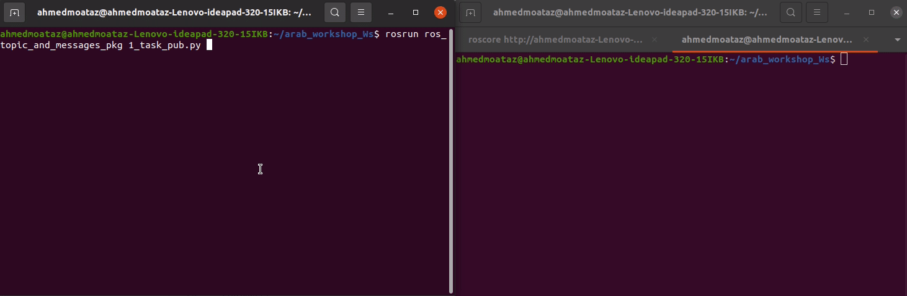

# Task: ROS Publisher and Subscriber

Before you begin this task, please try to write a similar example in a workshop or on your own. If you succeed in writing it without referring back to the example code, you're ready to start the task.

## Task 1

### Description
Write a ROS publisher node named "pub_node" and a subscriber node named "sub_node". The publisher node should publish the number 1 and increase this number by 1 every second.

### Expected Output


don't see any of tips before you try with yourself and tired from searching  

#### Tips for publisher
<details>
<summary><b>First Tip</b></summary>
To get started, search about `int` messages in ROS.
</details>

<details>
<summary><b>second Tip</b></summary>
import msg that used in the task 

```python
from std_msgs.msg import Int16
```
the variable that you publish it you need to Declare and intialize the variable before while loop becouse if you put it in loop will be 1 every loop becouse of you make Declaration and Initialization every loop

```python
number = 1
while not rospy.is_shutdown():
    # continue code ...
```

</details>

<details>
<summary><b>Third Tip</b></summary>
you need to make rate by 1,  
1 mean that the publisher publish one msg every one second

```python
    rate = rospy.Rate(1) 
```

If the task is not solved after all this, you are now joking.
You need to return the workshop tickets and complete the example again

</details>

#### Tips for subscriber

<details>
<summary><b>Forth Tip</b></summary>
you need to subscribe in tobic with same data type publisher

```python
    rospy.Subscriber('number_topic', Int16, number_callback)
```
</details>

<details>
<summary><b>Fifth Tip</b></summary>
you need to extract data with right format `number.data`

```python
        rospy.loginfo("the number received is : "+ str(number.data))
```
</details>


[for full code ](scripts)

## [<-Back to main](../../ros_topic_and_messages.md)


