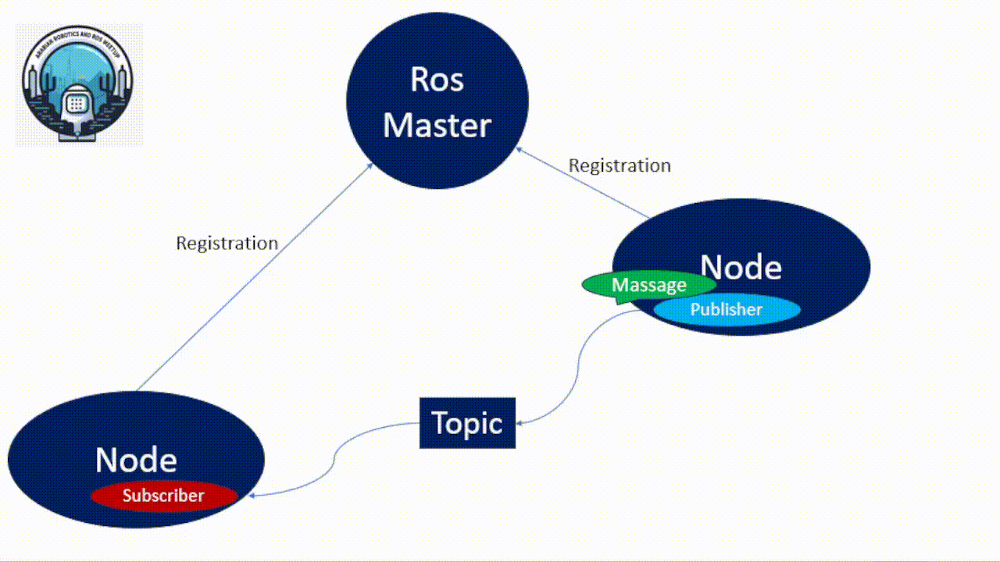
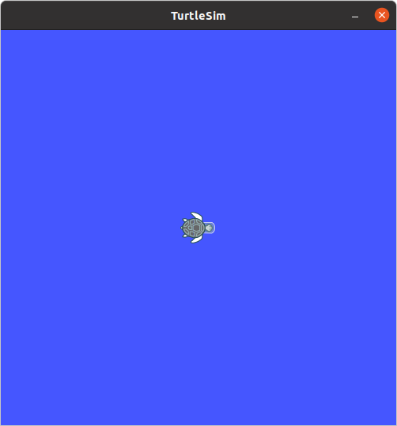
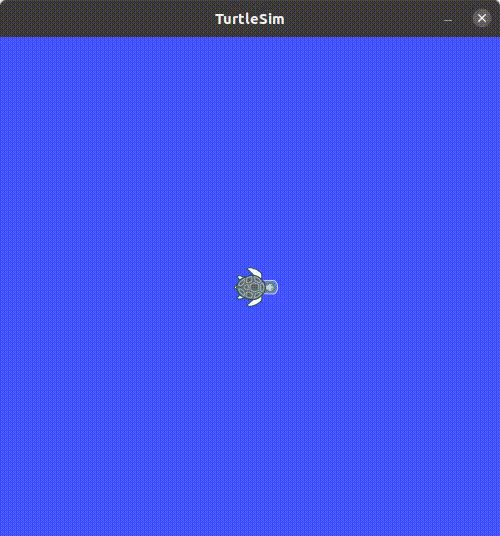
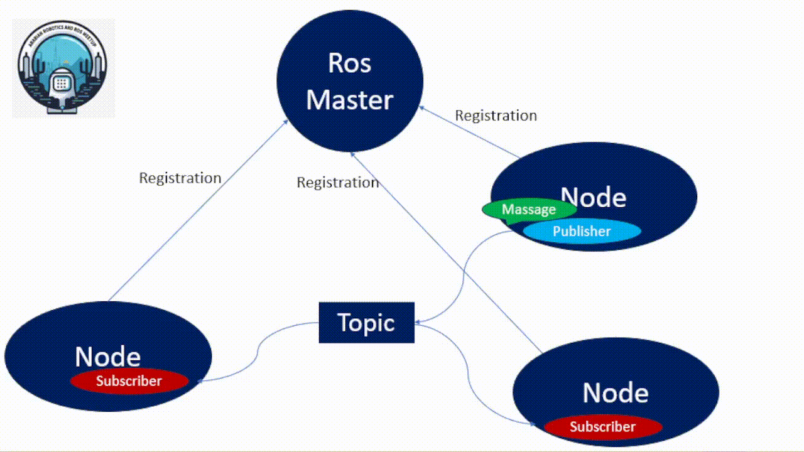
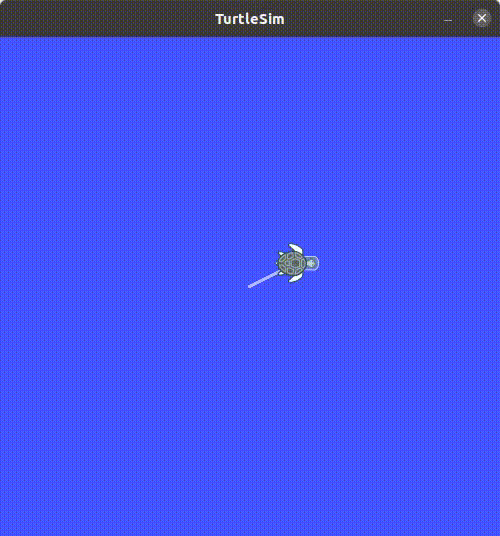
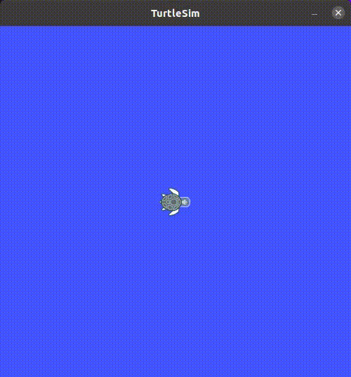

# ROS Node, Topic, Massage ,Publishers and Subscribers

Author: Sherif Fathey

Review : KG

## Table of Contents

- [ROS Nodes](#ros-nodes)
- [ROS Topics](#ros-topics)
- [ROS Messages](#ros-messages)
- [ROS Publishers and Subscribers](#ROS-Publishers-and-Subscribers)

## ROS Nodes

**`Nodes`** are executables that can communicate with other processes using topics,
services, or the Parameter Server.

Using nodes in ROS provides us with fault tolerance and separates the code and functionalities making the system simpler.

A node `must` have a `unique` name in the system. This name is used to permit the
node to communicate with another node using its name without ambiguity.

A `node` can be written using different libraries such as roscpp and rospy; roscpp is for C++ and rospy is for Python. Throughout this book, we will be using roscpp.

Each `node` in ROS should be responsible for a single, module purpose (e.g. one node for controlling wheel motors, one node for controlling a
laser range-finder, etc).



This illustrates the fundamental concept of ROS node communication using topics.

* The publisher node sends messages to a topic.
* the subscriber node receives those messages by subscribing to the same topic.

ROS has tools to handle nodes and give us information about it such as `rosnode`.
The tool `rosnode` is a command-line tool for displaying information about nodes,
such as listing the currently running nodes. The commands supported are as follows:

- **`rosnode info /node_name`** : This prints information about the node
- **`rosnode list`** : This lists the active nodes
- **`rosnode kill /node_name`** : This kills a running node or sends a given signal
- **`rosnode machine hostname`**: This lists the nodes running on a particular
  machine or lists the machines
- **`rosnode ping /node_name`**: This tests the connectivity to the node
- **`rosnode cleanup`**: This purges registration information from
  unreachable nodes

---

### we are going to use a typical package called `turtlesim`.

### To install the turtlesim package:

```
sudo apt-get install ros-noetic-turtlesim
```

### Before starting with anything, you must start `roscore` as follows:

```bash
roscore
```

### Now we are going to start a new node with `rosrun` as follows:

Here, the package name is `turtlesim` and the executable name is `turtlesim_node`.

```bash
rosrun turtlesim turtlesim_node
```

### We will then see a new window appear with a little turtle in the middle, as shown

in the following screenshot:

<p align="center">


#### **1- Listing All Running Nodes**

**You can find node names by using `rosnode`**

* `rosnode` will show you the names of all running nodes.This is especially useful when you want to interact with a node, or when you have a system running many nodes and need to keep track of them.

  Open a new terminal while turtlesim is still running in the other one, and enter the following command

  ```bash
  rosnode list 
  ```

  > The preceding command will return the node name

  ```bash
  /rosout
  /turtlesim
  ```

#### **2- Getting Information About a Specific Node**

You can see detailed information that can be used to debug your programs by using the following command

```bash
rosnode info /turtlesim
```

> `rosnode info` returns a list of subscribers, publishers, services, and actions (the ROS graph connections) that interact with that node.
> The output should look like this:

```bash
Node [/turtlesim]
Publications: 
 * /rosout [rosgraph_msgs/Log]
 * /turtle1/color_sensor [turtlesim/Color]
 * /turtle1/pose [turtlesim/Pose]

Subscriptions: 
 * /turtle1/cmd_vel [geometry_msgs/Twist]

Services: 
 * /clear
 * /kill
 * /reset
 * /spawn
 * /turtle1/set_pen
 * /turtle1/teleport_absolute
 * /turtle1/teleport_relative
 * /turtlesim/get_loggers
 * /turtlesim/set_logger_level
```

* **Publications** : These are topics where `turtlesim` publishes data for other nodes to receive.
* **Subscriptions** : These are topics where `turtlesim` listens for incoming data to process.
* **Services** : These provide specific functionalities that can be called by other nodes to interact with `turtlesim`.

---

### we are going to control `turtlesim` with teleop_key .

Now run turtle_teleop_key as follows:

```bash
rosrun turtlesim turtle_teleop_key
```

#### Use arrow keys to move the turtle.

- **`Up`** arrow Turtle In Turtle’s **`x`** direction
- **`Down`** arrow Turtle In Turtles’s **`-x`** direction
- **`Right`** arrow Rotate **`CW`**
- **`Left`** arrow Rotate **`CCW`**

  With this node, we can move the turtle using the arrow keys, as illustrated in the
following screenshot:

<p align="center">


If you want to see information about the **`/teleop_turtle`**

```bash
rosnode info teleop_turtle
```

The preceding command line prints the following information:

```bash
Node [/teleop_turtle]
Publications: 
 * /rosout [rosgraph_msgs/Log]
 * /turtle1/cmd_vel [geometry_msgs/Twist]

Subscriptions: None

Services: 
 * /teleop_turtle/get_loggers
 * /teleop_turtle/set_logger_level
```

##### **`rosnode` Commands That Used for Specific Purposes**

1-
```bash
rosnode kill /node_name
```

> **When to Use** : This command is typically used when you need to stop a node that is no longer needed or to restart it due to changes or issues. It is not used frequently in everyday operations.

2-

```bash
rosnode machine hostname
```

> **When to Use** : This command is used  where you need to manage or debug nodes across multiple machines in a distributed ROS system. It is not commonly used unless you are dealing with complex, multi-machine setups.

3-

```bash
rosnode ping /node_name
```

> **When to Use** : This command is used to verify that a node is running and reachable, often for debugging network issues or ensuring proper connectivity. It is not used regularly in routine operations.

4-

```bash
rosnode cleanup
```

> **When to Use** : This command is used to maintain a clean and accurate state of the ROS network, especially after nodes have been terminated but their information still lingers in the ROS master. It is not commonly used unless there are issues with stale node information.

## ROS Topics

Topics are **`pathways`** used by nodes to **`transmit data`**.

Topics can be transmitted without a direct connection between nodes, meaning the production and consumption of data are decoupled.

A topic can have `various` subscribers.

<p align="center">


Each `topic` is strongly typed by the ROS message type used to publish it, and nodes
can only receive messages from a matching type. A node can subscribe to a topic
only if it has the same message type.

ROS has a tool to work with topics called `rostopic`. It is a command-line tool that
gives us information about the topic or publishes data directly on the network.
This tool has the following parameters:

- **`rostopic bw /topic`**: This displays the bandwidth used by the topic.
- **`rostopic echo /topic`**: This prints messages to the screen.
  rostopic find message_type: This finds topics by their type.
- **`rostopic hz /topic`**: This displays the publishing rate of the topic.
- **`rostopic info /topic`**: This prints information about the active topic, the topics published, the ones it is subscribed to, and services.
- **`rostopic list`**: This prints information about active topics.
- **`rostopic pub /topic type args`**: This publishes data to the topic.
  It allows us to create and publish data in whatever topic we want, directly from the command line.
- **`rostopic type /topic`**: This prints the topic type, that is, the type of message it publishes.

**You can see the **`topics`** list  using the following command lines**:

```bash
rostopic list
```

The preceding command line prints the following information when run `turtlesim`:

```bash
/rosout
/rosout_agg
/turtle1/cmd_vel
/turtle1/color_sensor
/turtle1/pose
```

With the **`echo`** parameter, you can see the information sent by the node.

Run the following command line and use the arrow keys to see what data is
being sent:

```bash
rostopic echo /turtle1/cmd_vel
```

The preceding command line prints the following information:

```bash
linear: 
  x: 0.0
  y: 0.0
  z: 0.0
angular: 
  x: 0.0
  y: 0.0
  z: -2.0
```

You can see the type of **`message`** sent by the topic using the following command lines:

```
rostopic type /turtle1/cmd_vel 
```

The preceding command line prints the following information:

```
geometry_msgs/Twist
```

These tools are useful because, with this information, we can publish topics using the
command ,**`rostopic pub [topic] [msg_type] [args]`**:

Moving the Turtle **`Once`**

```bash
rostopic pub -1 /turtle1/cmd_vel geometry_msgs/Twist "linear:
  x: 2.0
  y: 1.0
  z: 0.0
angular:
  x: 0.0
  y: 0.0
  z: 0.0" 
```

<p align="center">


Make the turtle move in a **`circle`**:

```bash
rostopic pub -r 1 /turtle1/cmd_vel geometry_msgs/Twist "linear:
  x: 2.0
  y: 1.0
  z: 0.0
angular:
  x: 0.0
  y: 0.0
  z: 2.0" 
```

<p align="center">


## Ros Messages

A node sends information to another node using messages that are published
by topics.

The message has a simple structure that uses standard types or types
developed by the user.

Message types use the following standard ROS naming convention: the name of
the package, followed by /, and the name of the .msg file. For example, std_msgs/
msg/String.msg has the message type, std_msgs/String.

ROS has the command-line tool rosmsg to get information about messages.
The accepted parameters are as follows:

- **rosmsg show**: This displays the fields of a message
- **rosmsg list**: This lists all the messages
- **rosmsg package**: This lists all the messages in a package
- **rosmsg packages**: This lists all packages that have the message
- **rosmsg md5**: This displays the MD5 sum of a message

The message definition can consist of two types: **`fields`** and **`constants`** . The field is
split into field types and field name.

- **`Field`** types is the data type of the transmitting
  message and field name is the name of it.
- **`constants`** define a constant value in the
  message file.

Here is an example of message definitions:

- `int32 number`
- `string name`
- `float32 speed`

## Message types

- **`std_msgs`**: Provides basic message types like String, Int32, Float32, Bool, etc. These are used for simple communication between nodes.
- **`sensor_msgs`**: Contains messages for sensor data such as images (for camera imagess), LaserScan (for laser range data), Imu (for inertial measurement unit data), PointCloud2 (for point cloud data), etc.
- **`geometry_msgs`**: Defines messages for geometric data such as Point, Quaternion, Pose (position and orientation), Twist (linear and angular velocities), Transform (transformations between coordinate frames), etc.
- **`nav_msgs`**: Includes messages related to navigation tasks such as Odometry (robot's position and velocity), Path (sequence of poses representing a path), Map (occupancy grid map), etc.
- **`actionlib_msgs`**: Contains messages for defining actions and monitoring their execution, including GoalID, GoalStatus, etc.
- **`trajectory_msgs`** Defines messages for describing robot trajectories, including JointTrajectory (trajectory for robot joints), MultiDOFJointTrajectory (trajectory for multi-degree-of-freedom joints), etc.

Example:

- `std_msgs/String`
- `std_msgs/Char`
- `sensor_msgs/images`
- `sensor_msgs/LaserScan`
- `geometry_msgs/Pose`
- `nav_msgs/Odometry`
- `actionlib_msgs/GoalStatus`
- `trajectory_msgs/JointTrajectory`

If you want to see the **`message`** of **`turtlesim`** fields, you can do it with the following command lines:

```bash
rosmsg show turtlesim/Pose 
```

The preceding command line prints the following information:

```bash
float32 x
float32 y
float32 theta
float32 linear_velocity
float32 angular_velocity
```

If you want to list the **`message`** of **`turtlesim`** fields, you can do it with the following command lines:

```bash
rosmsg package turtlesim
```

The preceding command line prints the following information:

```bash
turtlesim/Color
turtlesim/Pose
```
If you want to list the **`message`** of **`All`** fields, you can do it with the following command lines:

```bash
rosmsg list 
```

The preceding command line prints the following information as it will show all the massages for all pkgs:

```bash
actionlib/TestAction
actionlib/TestActionFeedback
actionlib/TestActionGoal
actionlib/TestActionResult
actionlib/TestFeedback
actionlib/TestGoal
show more ...
```

If you want to list the **`All packages`** that contains massages, you can do it with the following command lines:

```bash
rosmsg packages turtlesim
```

The preceding command line prints the following information:

```bash
actionlib
actionlib_msgs
actionlib_tutorials
bond
control_msgs
diagnostic_msgs
dynamic_reconfigure
geometry_msgs
map_msgs
nav_msgs
roscpp
rosgraph_msgs
rospy_tutorials
sensor_msgs
shape_msgs
smach_msgs
std_msgs
stereo_msgs
tf
tf2_msgs
trajectory_msgs
turtle_actionlib
turtlesim
visualization_msgs
```

## Hands-On

### [Exmaple 1 To Creating custom messages_robot](source/example_custom_message_robot.md)
### [Exmaple 2 To Creating custom messages_sensor](source/example_custom_message_sensor.md)


# ROS Publishers and Subscribers

## Publishers

Publishers are nodes that send messages to a specific topic. They are responsible for generating data or information to be shared with other nodes in the system. Publishers create and send messages at a certain rate or in response to specific events.

### Key Points

- **Function**: Generate and send messages.
- **Trigger**: Based on a set rate or specific events.
- **API**:
  - **Python**: `rospy.Publisher()`
  - **C++**: `ros::Publisher`

## Subscribers

Subscribers are nodes that receive messages from a specific topic. They process the received messages and perform actions based on the data. Subscribers listen for messages on a particular topic and execute a callback function whenever a new message is received.

### Key Points

- **Function**: Receive and process messages.
- **Trigger**: Callback function execution on message receipt.
- **API**:
  - **Python**: `rospy.Subscriber()`
  - **C++**: `ros::Subscriber`

## Hands-On
### [Exmaple To Creating Publisher and Subscriber](source/exmaple_pub_sub.md)


### [Topic Task](source/task_1_pub_sub/topic_task.md)

### [Msg Task](source/task_2_custom_msg/msg_task.md)

---

## [Next Topic →](<../ROS Services And Actions/ros_services_and_action.md>)

## [↩Back to main](../README.md)


