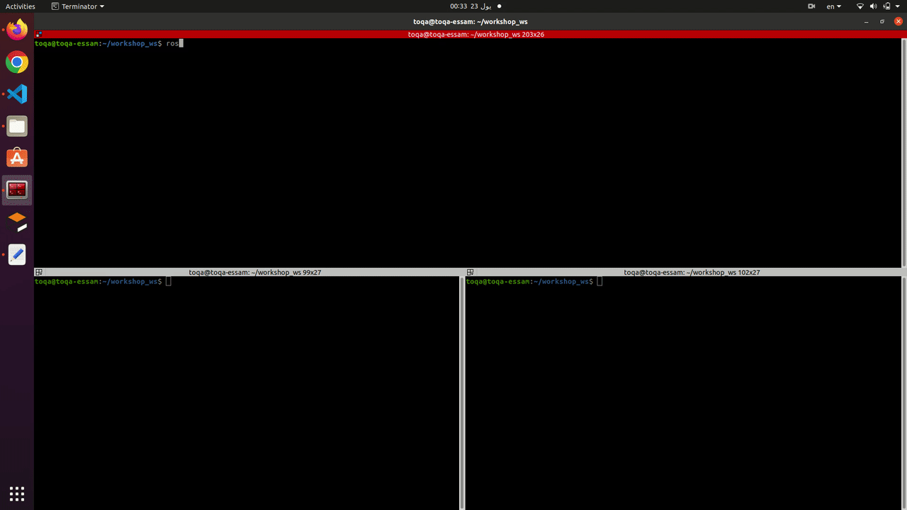

## Example 1 (Creating custom messages for robot pose)

**Description:**

    In this example we will create a package to publish and subscribe data for a robot position with a (X,Yand theta) componnent. This nodes (publish & subscribe) can be preformed in Python and Cpp as shown below.

### **1-Create a ROS Package**

    First, create a new ROS package if you don't already have one. You can do this using the`catkin_create_pkg` command

```bash
mkdir -p  catkin_ws/src
cd ~/catkin_ws
catkin_make
cd ~/catkin_ws/src
catkin_create_pkg ros_topic_and_messages_pkg std_msgs rospy roscpp
```

### 2- Define a custom message :

Let's say you want to create a custom message type for a sensor that measures temperature and humidity.
Create a file named [Position.msg](../ros_topic_and_messages_pkg/msg/Position.msg) in your ROS package's [msg](../ros_topic_and_messages_pkg/msg) directory:

```bash
cd ~/catkin_ws/src/ros_topic_and_messages_pkg
mkdir msg
cd msg
touch Position.msg
```

And add the following text in the [Position.msg](../ros_topic_and_messages_pkg/msg/Position.msg) file.

```bash
float64 x
float64 y
float64 theta
```

### 3- Compile the message

Make sure your [CMakeLists.txt ](../ros_topic_and_messages_pkg/CMakeLists.txt) contains the following lines to ensure that your custom message is compiled:

```Cpp
find_package(catkin REQUIRED COMPONENTS
  message_generation
  roscpp
  rospy
  std_msgs
)
add_message_files(
  FILES
  Position.msg
)
generate_messages(
  DEPENDENCIES
  std_msgs
)
```

### 4-Write publisher and subscriber nodes

#### 1- Python Node

first creat a [script ](../ros_topic_and_messages_pkg/script) folder to create the .py file in it

```bash
cd ~/catkin_ws/src/ros_topic_and_messages_pkg
mkdir script
cd script
touch publish_robot.py
```

[publish_robot ](../ros_topic_and_messages_pkg/script/publish_robot.py):

```py
#!/usr/bin/env python3

import rospy
from ros_topic_and_messages_pkg.msg import Position
from random import random

def publisher():
    rospy.init_node('position_publisher', anonymous=True)
    pub = rospy.Publisher('robot_position', Position, queue_size=10)
    rate = rospy.Rate(1)  # 1 Hz
    while not rospy.is_shutdown():
        msg = Position()
        msg.x = random() * 10  # Random x position
        msg.y = random() * 10  # Random y position
        msg.theta = random() * 3.14  # Random theta (orientation)
        rospy.loginfo("Publishing: x=%f, y=%f, theta=%f", msg.x, msg.y, msg.theta)
        pub.publish(msg)
        rate.sleep()

if __name__ == '__main__':
    try:
        publisher()
    except rospy.ROSInterruptException:
        pass


```

[subscribe_robot ](../ros_topic_and_messages_pkg/script/subscribe_robot.py):

```bash
touch subscribe_robot.py
```

```py
#!/usr/bin/env python3

import rospy
from ros_topic_and_messages_pkg.msg import Position

def callback(data):
    rospy.loginfo("Received: x=%f, y=%f, theta=%f", data.x, data.y, data.theta)

def subscriber():
    rospy.init_node('position_subscriber', anonymous=True)
    rospy.Subscriber('robot_position', Position, callback)
    rospy.spin()

if __name__ == '__main__':
    subscriber()


```

#### Run the Package

* Open a terminal an run the roscore by the following command

```bash
roscore
```

* In Another terminal go to the workspace created and run the publisher by using the following commands

```bash
cd /catkin_ws
source devel/setup.bash
rosrun rosrun ros_topic_and_messages_pkg publish_robot.py
```

* In Another terminal go to the workspace created and run the subscriber by using the following commands

```bash
cd /catkin_ws
source devel/setup.bash
rosrun rosrun ros_topic_and_messages_pkg subscriber_robot.py
```

#### 2- CPP Node

first creat a [src ](../ros_topic_and_messages_pkg/src) folder to create the .cpp file in it

```bash
cd ~/catkin_ws/src/ros_topic_and_messages_pkg
mkdir src
cd src
touch publish_robot.cpp
```

[publish_robot.cpp](../ros_topic_and_messages_pkg/src/publish_robot.cpp):

```cpp
#include <ros/ros.h>
#include <ros_topic_and_messages_pkg/Position.h>  

int main(int argc, char** argv)
{
    ros::init(argc, argv, "position_publisher");
    ros::NodeHandle nh;
    ros::Publisher pub = nh.advertise<ros_topic_and_messages_pkg::Position>("robot_position", 10);
    ros::Rate rate(1);  // 1 Hz

    while (ros::ok())
    {
        ros_topic_and_messages_pkg::Position msg;
        msg.x = rand() % 10;  // Random x position
        msg.y = rand() % 10;  // Random y position
        msg.theta = static_cast<float>(rand()) / RAND_MAX * 3.14;  // Random theta (orientation)
        ROS_INFO("Publishing: x=%f, y=%f, theta=%f", msg.x, msg.y, msg.theta);
        pub.publish(msg);
        rate.sleep();
    }

    return 0;
}

```

[subscribe_robot ](../ros_topic_and_messages_pkg/src/):

```bash
touch subscribe_robot.cpp
```

```cpp
#include <ros/ros.h>
#include <ros_topic_and_messages_pkg/Position.h>  

void callback(const ros_topic_and_messages_pkg::Position::ConstPtr& data)
{
    ROS_INFO("Received: x=%f, y=%f, theta=%f", data->x, data->y, data->theta);
}

int main(int argc, char** argv)
{
    ros::init(argc, argv, "position_subscriber");
    ros::NodeHandle nh;
    ros::Subscriber sub = nh.subscribe("robot_position", 10, callback);
    ros::spin();

    return 0;
}
```

Edit the [CMakeLists.txt ](../ros_topic_and_messages_pkg/CMakeLists.txt) file by adding the following lines in the file in the build section:

```bash
 add_executable(publish_robot src/publish_robot.cpp)
 add_executable(subscribe_robot src/subscribe_robot.cpp)
```

```bash
 add_dependencies(publish_robot ${${PROJECT_NAME}_EXPORTED_TARGETS} ${catkin_EXPORTED_TARGETS})
 add_dependencies(subscribe_robot ${${PROJECT_NAME}_EXPORTED_TARGETS} ${catkin_EXPORTED_TARGETS})
```

```bash
 target_link_libraries(publish_robot
   ${catkin_LIBRARIES}
 )
 target_link_libraries(subscribe_robot
   ${catkin_LIBRARIES}
 )
```

### 5- Run the Package

* Open a terminal an run the roscore by the following command

```bash
roscore
```

* In Another terminal go to the workspace created and run the publisher by using the following commands

```bash
cd /catkin_ws
source devel/setup.bash
rosrun rosrun ros_topic_and_messages_pkg publish_robot
```

* In Another terminal go to the workspace created and run the subscriber by using the following commands

```bash
cd /catkin_ws
source devel/setup.bash
rosrun rosrun ros_topic_and_messages_pkg subscriber_robot
```


## Expected Output

Here is the expected output of this example




## [&lt;- Exmaple 2 To Creating custom messages_sensor)](../source/example_custom_message_sensor.md)

## [&lt;-Back to main](../ros_topic_and_messages.md)
