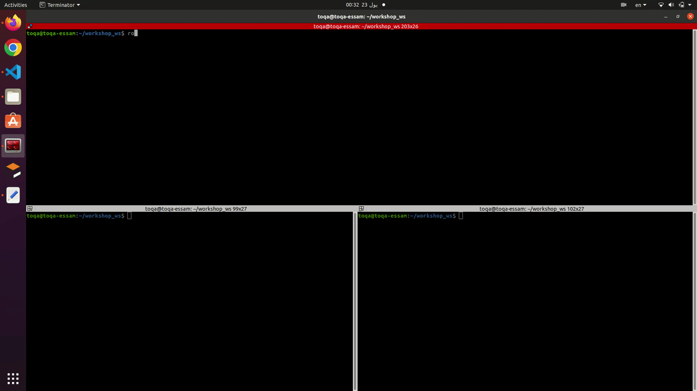
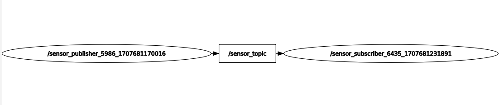

## [&lt;- Exmaple 1 To Creating custom messages_robot](../source/example_custom_message_robot.md)

**Note:** this example is continuation of the previous example.

## Example 2 (Creating custom messages for sensor data)

#### 1- Define a custom message :

Let's say you want to create a custom message type for a sensor that measures temperature and humidity.
Create a file named [SensorData.msg](../ros_topic_and_messages_pkg/msg/SensorData.msg) in your ROS package's [msg](../ros_topic_and_messages_pkg/msg) directory:

```bash
cd ~/catkin_ws/src/ros_topic_and_messages_pkg/msg
touch SensorData.msg
```

And add the following text in the [SensorData.msg](../ros_topic_and_messages_pkg/msg/SensorData.msg) file.

```bash
# SensorData.msg
float32 temperature
float32 humidity
```

### 2- Compile the message

Make sure your `CMakeLists.txt` contains the following lines to ensure that your custom message is compiled:

```Cpp
find_package(catkin REQUIRED COMPONENTS
  message_generation
  roscpp
  rospy
  std_msgs
)
add_message_files(
  FILES
  SensorData.msg
)
generate_messages(
  DEPENDENCIES
  std_msgs
)
```

### 3-Write publisher and subscriber nodes

#### 1- Python node:

In the [script ](../ros_topic_and_messages_pkg/script) file create a file named by [publish_sensor_data.py](../ros_topic_and_messages_pkg/script/publish_sensor_data.py) by using the following commands:

```bash
cd ~/catkin_ws/src/ros_topic_and_messages_pkg/script
touch publish_robot_data.py
```

Add the below code in the file:

```py
#!/usr/bin/env python3

import rospy
from name_of_pkg.msg import SensorData
import random

def publish_sensor_data():
    rospy.init_node('sensor_publisher', anonymous=True)
    pub = rospy.Publisher('sensor_topic', SensorData, queue_size=10)
    rate = rospy.Rate(1)  # 1 Hz
    while not rospy.is_shutdown():
        sensor_data = SensorData()
        sensor_data.temperature = random.uniform(20.0, 30.0)
        sensor_data.humidity = random.uniform(40.0, 60.0)
        rospy.loginfo("Publishing sensor data: Temperature=%f, Humidity=%f", sensor_data.temperature, sensor_data.humidity)
        pub.publish(sensor_data)
        rate.sleep()

if __name__ == '__main__':
    try:
        publish_sensor_data()
    except rospy.ROSInterruptException:
        pass

```

For the subsribe node create a file named by [subscribe_sensor_data.py](../ros_topic_and_messages_pkg/script/subscribe_sensor_data.py) in the [script ](../ros_topic_and_messages_pkg/script) folder using the following commands as shown:

```bash
cd ~/catkin_ws/src/ros_topic_and_messages_pkg/script
touch subscribe_robot_data.py
```

Add the below code in the file:

```py
#!/usr/bin/env python3

import rospy
from name_of_pkg.msg import SensorData

def sensor_data_callback(data):
    rospy.loginfo("Received sensor data: Temperature=%f, Humidity=%f", data.temperature, data.humidity)

def subscribe_sensor_data():
    rospy.init_node('sensor_subscriber', anonymous=True)
    rospy.Subscriber('sensor_topic', SensorData, sensor_data_callback)
    rospy.spin()

if __name__ == '__main__':
    subscribe_sensor_data()

```

#### Run the Package

* Open a terminal an run the roscore by the following command

```bash
roscore
```

* In Another terminal go to the workspace created and run the publisher by using the following commands

```bash
cd /catkin_ws
source devel/setup.bash
rosrun rosrun ros_topic_and_messages_pkg publish_robot_data.py
```

* In Another terminal go to the workspace created and run the subscriber by using the following commands

```bash
cd /catkin_ws
source devel/setup.bash
rosrun rosrun ros_topic_and_messages_pkg subscriber_robot_data.py
```

#### 2- CPP Node

In the [src ](../ros_topic_and_messages_pkg/src) file create a file named by [publish_sensor_data.cpp](../ros_topic_and_messages_pkg/src/publish_sensor_data.cpp) by using the following commands:

```bash
cd ~/catkin_ws/src/ros_topic_and_messages_pkg/rc
touch publish_robot.cpp
```

Add the below code in the file:

```cpp
#include <iostream>
#include <ros/ros.h>
#include "ros_topic_and_messages_pkg/SensorData.h"
#include <random>

void publish_sensor_data() {
    ros::init(argc, argv, "sensor_publisher");
    ros::NodeHandle nh;
    ros::Publisher pub = nh.advertise<ros_topic_and_messages_pkg::SensorData>("sensor_topic", 10);
    ros::Rate rate(1);  // 1 Hz

    while (ros::ok()) {
        ros_topic_and_messages_pkg::SensorData sensor_data;
        sensor_data.temperature = std::uniform_real_distribution<double>(20.0, 30.0)(std::default_random_engine());
        sensor_data.humidity = std::uniform_real_distribution<double>(40.0, 60.0)(std::default_random_engine());

        ROS_INFO("Publishing sensor data: Temperature=%f, Humidity=%f", sensor_data.temperature, sensor_data.humidity);
        pub.publish(sensor_data);
        rate.sleep();
    }
}

int main(int argc, char** argv) {
    try {
        publish_sensor_data();
    } catch (ros::ROSInterruptException& e) {
        // Handle exception
    }
    return 0;
}

```

For the subsribe node create a file named by [subscribe_sensor_data.cpp](../ros_topic_and_messages_pkg/src/subscribe_sensor_data.cpp) in the [src ](../ros_topic_and_messages_pkg/src) folder using the following commands as shown:

```bash
cd ~/catkin_ws/src/ros_topic_and_messages_pkg/src
touch subscribe_robot_data.cpp
```

Add the below code in the file:

```cpp
#include <iostream>
#include <ros/ros.h>
#include "ros_topic_and_messages_pkg/SensorData.h"

void sensorDataCallback(const ros_topic_and_messages_pkg::SensorData::ConstPtr& data) {
    ROS_INFO("Received sensor data: Temperature=%f, Humidity=%f", data->temperature, data->humidity);
}

int main(int argc, char** argv) {
    ros::init(argc, argv, "sensor_subscriber");
    ros::NodeHandle nh;

    ros::Subscriber sub = nh.subscribe("sensor_topic", 10, sensorDataCallback);

    ros::spin();

    return 0;
}

```

Edit the [CMakeLists.txt ](../ros_topic_and_messages_pkg/CMakeLists.txt) file by adding the following lines in the file in the build section:

```bash
 add_executable(publish_robot_data src/publish_robot_data.cpp)
 add_executable(subscribe_robot_data src/subscribe_robot_data.cpp)
```

```bash
 add_dependencies(publish_robot_data ${${PROJECT_NAME}_EXPORTED_TARGETS} ${catkin_EXPORTED_TARGETS})
 add_dependencies(subscribe_robot_data ${${PROJECT_NAME}_EXPORTED_TARGETS} ${catkin_EXPORTED_TARGETS})
```

```bash
 target_link_libraries(publish_robot_data
   ${catkin_LIBRARIES}
 )
 target_link_libraries(subscribe_robot_data
   ${catkin_LIBRARIES}
 )
```

### 5- Run the Package

* Open a terminal an run the roscore by the following command

```bash
roscore
```

* In Another terminal go to the workspace created and run the publisher by using the following commands

```bash
cd /catkin_ws
source devel/setup.bash
rosrun rosrun ros_topic_and_messages_pkg publish_robot_data
```

* In Another terminal go to the workspace created and run the subscriber by using the following commands

```bash
cd /catkin_ws
source devel/setup.bash
rosrun rosrun ros_topic_and_messages_pkg subscriber_robot_data
```


## Expected Output

Here is the expected output of this example





## [&lt;-Back to main](../ros_topic_and_messages.md)
