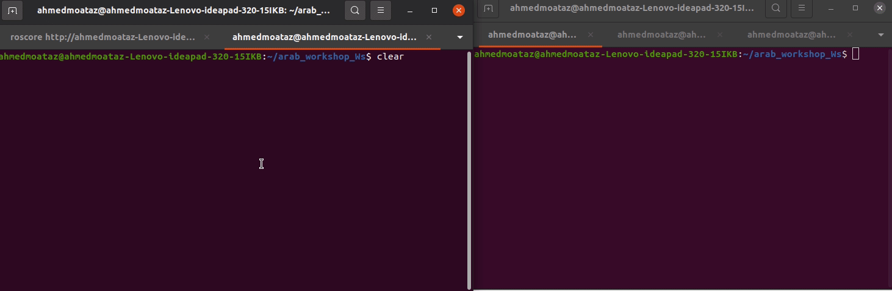

# Task: ROS Custom massage

Before you begin this task, please try to write a similar example in a workshop or on your own. If you succeed in writing it without referring back to the example code, you're ready to start the task.

## Task 2

### Description

Write a ROS custom massage ('name','age','grade in high scool')
and write ROS publisher and subscriber and use this msg to send from publisher and recive from subscriber

### Expected Output



don't see any of tips before you try with yourself and tired from searching

#### Tips for Custom msg

<details>
<summary><b>First Tip</b></summary>
make sure in `CMakeLists` 
1- in find_package : `message_generation`
```bash
find_package(catkin REQUIRED COMPONENTS
  roscpp
  rospy
  std_msgs
  message_generation
)
```
2- in add_message_files: name the file in msg
```bash
add_message_files(
  FILES
  my_info.msg
)
```

3- generate_messages: not commmented

```bash
generate_messages(
  DEPENDENCIES
  std_msgs
)
```

make sure in `package.xml` you add

```bash
  <build_depend>message_generation</build_depend>
  <exec_depend>message_runtime</exec_depend>

```

</details>

#### Tips for using Custom msg

<details>
<summary><b>second Tip</b></summary>
1- import msg from your package 
`from your_package.msg import file_name_from_msg_folder`

```py
from custom_msg_task_pkg.msg import my_info
```

2- access data right
`your_file.name`
`your_file.age`

```py

info_data.name = "Mo3taz"
info_data.age = 24
info_data.high_school_degree = 92

```

</details>

[for full package ](custom_msg_task_pkg)

## [↩Back to main](../../ros_topic_and_messages.md)
