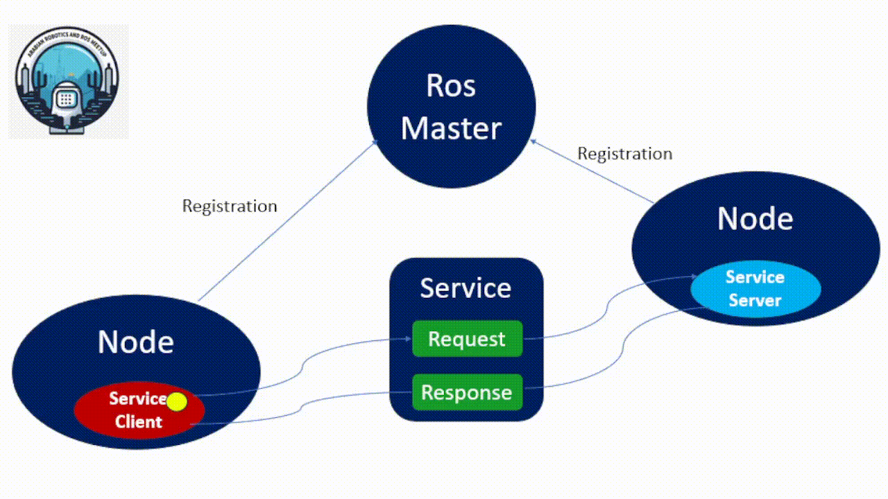
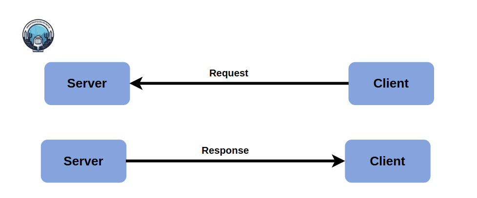
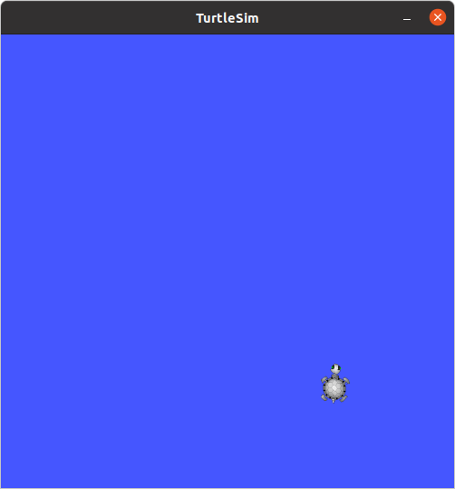
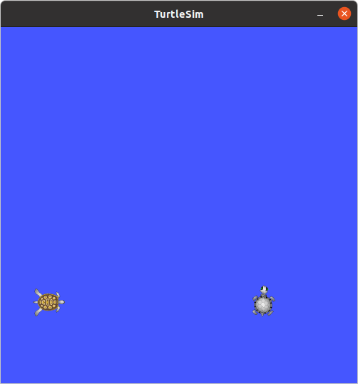
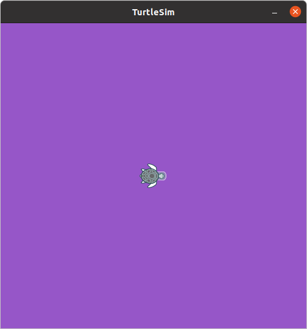
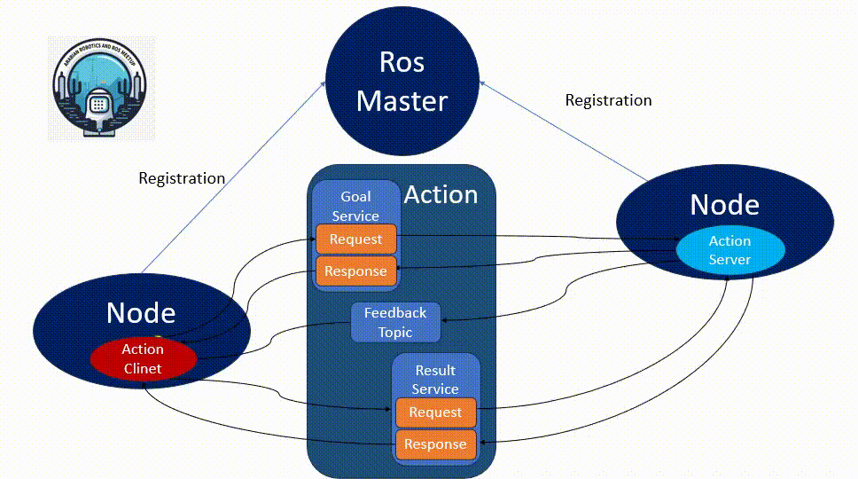
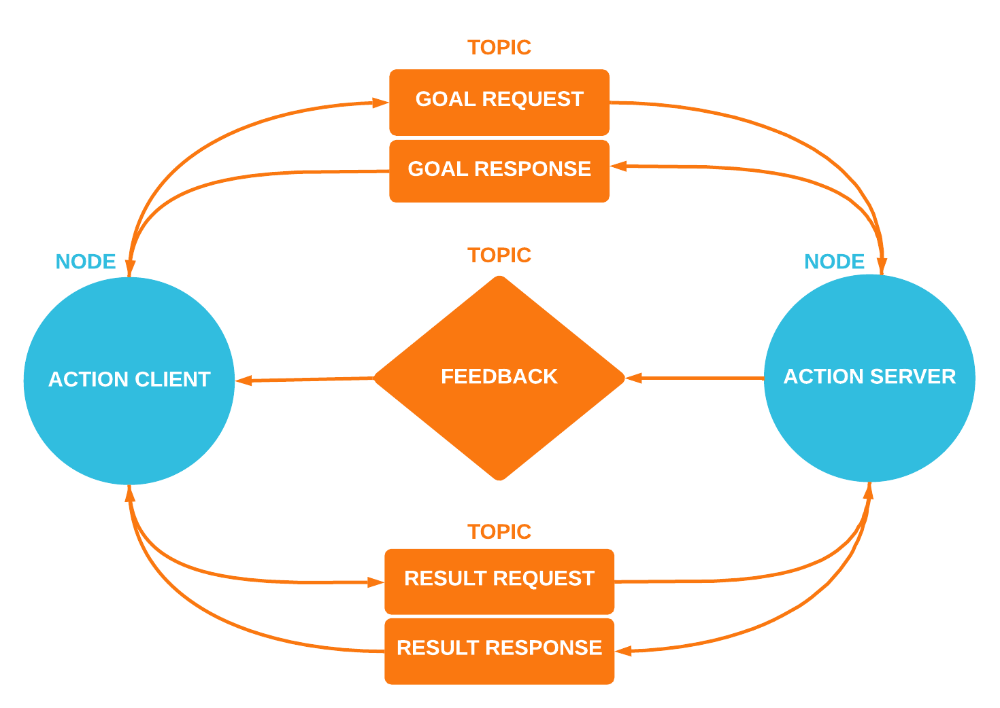

# **ROS Services**

Author:

Review :

## 1. Introduction

- A ROS **`service`** is a way for nodes in a ROS system to **`request`** and **`receive`** information from other nodes.
- Services are defined using the ROS service definition language and are similar to messages in that they are simple data structures, but they include a request and a response message.
- When a client node sends a service request to a server node, the server node processes the request and sends back a response. The request and response messages contain specific fields defined in the service definition file. This mechanism enables synchronous communication between nodes, where one node can directly query another and receive a reply.
- Communication on service is bidirectional synchronous communication between the service client requesting a service and the service server responding to the request. Unlike topics, services have no publishers or subscribers.

<p align="center">


## **2. Service Servers and Clients**

- The **server** listens for incoming communications. Upon receiving a request, it computes the necessary operations and sends back the response to the service.
- The **client** sends a request to the service and then waits for the response, **blocking** the terminal from performing other actions until the response is received. **(Unlike actions, which are asynchronous and allow you to perform additional commands while they are in progress, services operate synchronously.)**

<p align="center"> 

<p align="center"> 

### 2.1. Service Files

The message types used with services are derived from the eligible .msg types, as discussed in the previous section of this workshop. However, service messages are defined in a specialized file format known as a **.srv** file.

#### Eligible Service Field Types

Exactly the same as messages!

Service files are essentially two message files combined into one!

```
 Eligible message field types:
 - int8, int16, int32, int64 (plus uint*)
 - float32, float64
 - string
 - time, duration
 - other msg files
 - variable-length array[] and fixed-length array[C]
 - the special Header type
```

#### Example .srv file

A .srv file is **similar** (it's just two message files smushed into one, one request, one response.)

The sections are separated by three dashes. It has to be done this way.

```
request
---
response
```

Example:

```
int64 A
int64 B
---
int64 Sum
```

### 2.2. Command Line

ROS has two command-line tools to work with services, **`rossrv`** and **`rosservice`** .

> NOTE: `rosservice` is **different** from `rossrv`, which does the same thing that `rosmsg` does for .srv files.

You can use `rosservice` in the same way `rostopic` is used to publish and subscribe to topics, except now you're **calling the service.**
With rossrv , we can see information about the services data structure,With rosservice , we can list and query services. The commands supported are as follows:

- **List available services :**

```
$ rosservice list
```

- **Show the type of the service (what messages it takes)**

```
$ rosservice type /service_name
```

- **Call a service**

```
$ rosservice call /service_name 
```

- **Print service arguments**

```
$ rosservice args /service
```

- **find services by the service type**

```
rosservice find msg-type
```

- **print information about the service**

```
rosservice info /service
```

- **print the service type**

```
rosservice type /service
```

- **prints the service ROSRPC URI**

```
rosservice uri /service
```

### 2.3. Some Practice

We are going to list the services available for the **`turtlesim`** node by using the following code, so if it is not working, run **`roscore`** and **`run`** the **`turtlesim`** node:

```bash
rosservice list
```

Now, You are expected to see the following output:

```bash
/clear
/kill
/reset
/rosout/get_loggers
/rosout/set_logger_level
/spawn
/turtle1/set_pen
/turtle1/teleport_absolute
/turtle1/teleport_relative
/turtlesim/get_loggers
/turtlesim/set_logger_level
```

If you want to see the type of any service, for example, the **/clear service**, use:

```bash
rosservice type /clear
```

You will then obtain:

```bash
std_srvs/Empty
```

To invoke a service, you will use **rosservice call [service] [args]** . If you want
to invoke the `/clear` service, use:

```bash
rosservice call /clear
```

In the `turtlesim` window, you will now see that the `lines` created by the movements
of the turtle will be `deleted`.

<p align="center">


Now, we are going to try another service, for example, the `/spawn` service. This
service will `create` another turtle in another location with a different orientation.

To start with, we are going to see the following type of message:

```bash
rosservice type /spawn | rossrv show
```

We will then obtain the following:

```bash
float32 x
float32 y
float32 theta
string name
---
string name
```

With these fields, we know how to invoke the service. We need the positions of
x and y, the orientation (theta), and the name of the new turtle:

```bash
rosservice call /spawn 1.5 2.5 0.0 "new_turtle_2"
```

We then obtain the following result:

<p align="center">


## 3. Using the Parameter Server

The Parameter Server is used to store data that is accessible by all the nodes.

ROS has a tool to manage the Parameter Server called rosparam . The accepted parameters are as follows:

```shell
$ **rosparam set parameter** value
# This sets the parameter

$ rosparam get parameter
# This gets the parameter

$ rosparam load file
# This loads parameters from the file

$ rosparam dump file
# This dumps parameters to the file

$ rosparam delete parameter
# This deletes the parameter

$ rosparam list
# This lists the parameter names

```

For example, we can see the parameters in the server that are used by all the nodes:

```bash
rosparam list
```

We obtain the following output:

```bash
/rosdistro
/roslaunch/uris/host_ubuntu__37307
/rosversion
/run_id
/turtlesim/background_b
/turtlesim/background_g
/turtlesim/background_r
```

The `background` parameters are of the `turtlesim` node.
These parameters change the color of the windows that are initially blue. If you want to read a value, you will
use the get parameter:

```bash
rosparam get /turtlesim/background_r
```

To set a new value, you will use the set parameter:

```bash
rosparam set /turtlesim/background_r 150 
```

We then obtain the following result:

<p align="center">


## 4.Hands-On

### 4.1. [Exmaple For Creating custom services](source/exmaple_custom_services.md)

### 4.2. [Service Task](source/task_custom_service/Task_service.md)

---

#### Note : Refresher on `argv`

`sys.argv` is a list in Python that holds the command-line arguments passed to a script. It is based on the `argc` and `argv` concept from C++ (argument count and argument vector).

Here's how `sys.argv` works:

* The **first** element, `sys.argv[0]`, is the name of the script being executed.
* The elements **beyond** the first (i.e., `sys.argv[1]`, `sys.argv[2]`, etc.) are the arguments provided to the script, listed in the order they were given.

This is why, in the ROS Python service example, you see references to `sys.argv[1]`, `sys.argv[2]`, etc., to access the command-line arguments passed to the script.

    -------------------------------------------------------------------------------------------------------------------------

# ROS Actions

## 1. Introduction

- A ROS action is just like a ROS service, a special kind of topic that allows for two-way communication between nodes. But with some valuable, and notable differences.
- ROS **`action`** provides a way for nodes to perform long-running tasks asynchronously and to receive updates about the progress of these tasks. Actions are suitable for tasks that may take a significant amount of time and where the client may need to check on the status or cancel the request if needed.

* Actions are defined using the ROS action definition language and involve three types of messages: goal, feedback, and result. These messages are used to represent the goal of the action, provide feedback on the progress, and deliver the final result.
* When a client node sends an action goal to a server node, the server processes the goal and periodically sends feedback to the client about the progress of the action. Once the action is completed, the server sends the final result back to the client. This mechanism allows for asynchronous communication where the client can continue performing other tasks while waiting for the action to complete.
* Actions support preemption and cancellation, meaning that the client can cancel an ongoing action if necessary. This is a key feature that differentiates actions from **services**, which provide **synchronous** communication without such ongoing feedback or cancellation capabilities.

## 2. Action Server and Client

### 2.1. Action Server:

An action server is a ROS node that implements an action. It performs the following tasks:

* **Receives Goal Requests** : The server listens for goal requests from action clients.
* **Executes Tasks** : Upon receiving a goal, the server starts executing the task associated with that goal.
* **Provides Feedback** : During task execution, the server periodically publishes feedback messages to inform clients about the progress.
* **Sends Final Result** : Once the task is complete, the server sends a final result message to the client.

The action server can handle multiple requests concurrently, enabling simultaneous task execution. It advertises the action topic and listens for messages sent to the `/goal` or `/cancel` topics. When a valid goal is sent to `/goal`, the server executes the specified action, changing its status accordingly. During execution, the server constantly publishes feedback messages to the `/feedback` topic, providing updates on the task's progress. Upon completion, error, or a stop command (pre-empt) sent to `/cancel`, the action concludes and publishes the appropriate result message to the `/result` topic.

### 2.2. Action Client:

An action client is a ROS node responsible for requesting and managing actions from an action server. Its functions include:

* **Sending Goals** : The client sends a goal to the action server, specifying the task to be executed.
* **Receiving Feedback** : During the action's execution, the client receives periodic feedback from the server, allowing it to monitor the progress.
* **Receiving Final Results** : Once the action is completed, the client receives the final result from the server.

The action client operates asynchronously, meaning it can continue with its program flow while waiting for the action to complete. This allows the client to perform other tasks concurrently, making interaction with the action server efficient. The client publishes to the action topic and can poll the `/feedback`, `/status`, and `/goal` topics to get information about the action's execution. Because action calls are asynchronous, the client does not block its program flow, unlike service calls which are blocking.

<p align="center">


### 2.3. Action Topics

The Action topic is special, because it consists of 5 topics under its namespace:

- **/goal**

  - You send the desired goal to trigger the action here
- **/cancel**

  - You send a cancel signal to stop the action execution
- **/status**

  - Shows the status of the action server
- **/result**

  - Shows any end state messages from action execution
- **/feedback**

  - Shows any running messages during action execution.

#### **2.4. Details about Goal, Feedback, and Result:**

<p align="center">
  
</p>

> **Goal**
> To accomplish tasks using actions, we introduce the notion of a goal that can be sent to an ActionServer by an ActionClient. In the case of moving the base, the goal would be a PoseStamped message that contains information about where the robot should move to in the world. For controlling the tilting laser scanner, the goal would contain the scan parameters (min angle, max angle, speed, etc).
>
> **Feedback**
> Feedback provides server implementers a way to tell an ActionClient about the incremental progress of a goal. For moving the base, this might be the robot's current pose along the path. For controlling the tilting laser scanner, this might be the time left until the scan completes.
>
> **Result**
> A result is sent from the ActionServer to the ActionClient upon completion of the goal. This is different than feedback, since it is sent exactly once. This is extremely useful when the purpose of the action is to provide some sort of information. For move base, the result isn't very important, but it might contain the final pose of the robot. For controlling the tilting laser scanner, the result might contain a point cloud generated from the requested scan.
>
> (Source: http://wiki.ros.org/actionlib)

### 2.5. Action Files

The message types used in action files are derived from standard .msg types, similar to how services use message definitions.

But the action messages are defined in a special type of file called a .action file.

#### **Eligible Action Field Types**

Action files are just three message files 'smushed' into one! (As opposed to service files' two.)

> Eligible message field types
>
> - int8, int16, int32, int64 (plus uint*)
> - float32, float64
> - string
> - time, duration
> - other msg files
> - variable-length array[] and fixed-length array[C]
> - the special Header type

#### **Example .action file**

```
  Header header
  string child_frame_id
  geometry_msgs/PoseWithCovariance pose
  geometry_msgs/TwistWithCovariance twist
```

An .action file is **similar** (it's just three message files smushed into one, goal, result, feedback)

Again, the sections are separated by three dashes!

```
goal
---
result
---
feedback
```

Eg:

```
#goal definition
int32 order
---
#result definition
int32[] sequence
---
#feedback
int32[] sequence
```

### 2.6. Command Line

ROS has no special command line interface for interacting with actions. Do it via `rostopic`

```shell
# List available actions
# Look for the /goal, /cancel, /status, /result, /feedback pattern
$ rostopic list

# Show the type of the service (what messages it takes)
$ rostopic type /action_topic

# Call a service
# Just publish the goal!
$ rostopic pub /action_topic/goal goal_msg_type [CONTENT]
```

### 2.7. Action Callbacks

Just befor moving to practice would like to speak about action callbacks .

These callbacks are functions that handle specific events in the action lifecycle.

```cpp
ac.sendGoal(goal, &doneCallback, &activeCallback, &feedbackCallback);
```

* **Done Callback** : Triggered when the action has completed. This callback handles the final result of the action, indicating whether it succeeded, failed, or was preempted.
* **Active Callback** : Called when the action server starts processing a new goal. This callback is used to handle initialization tasks or to notify that the action has begun.
* **Feedback Callback** : Periodically invoked during the execution of the action to provide updates on the task's progress. This callback sends feedback to the client, allowing it to monitor and respond to the ongoing status of the action.

## 3. Hands-on

### 3.1. [Exmaple To Creating action server/clients](/source/example_action.md)

### 3.2. [Action Task](source/task_custom_action/Task_action.md)
