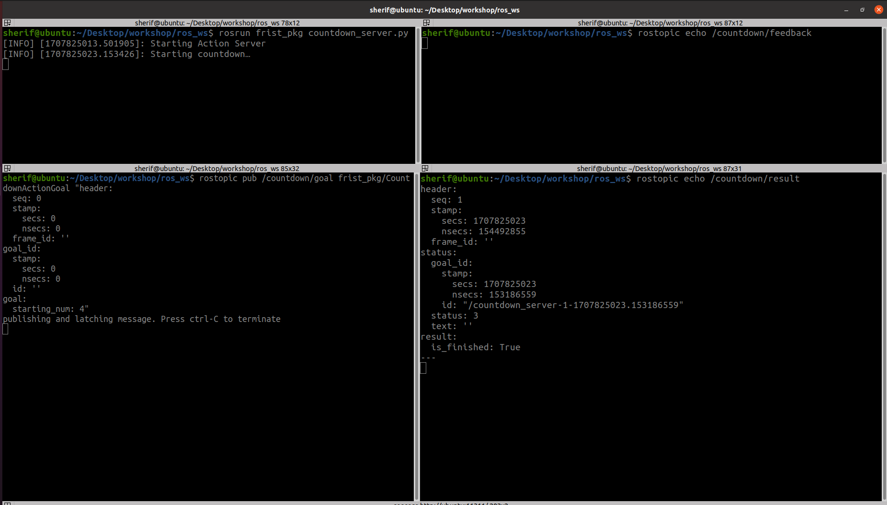
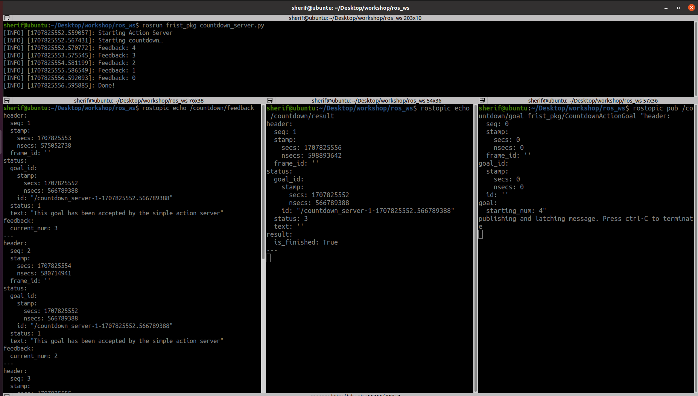
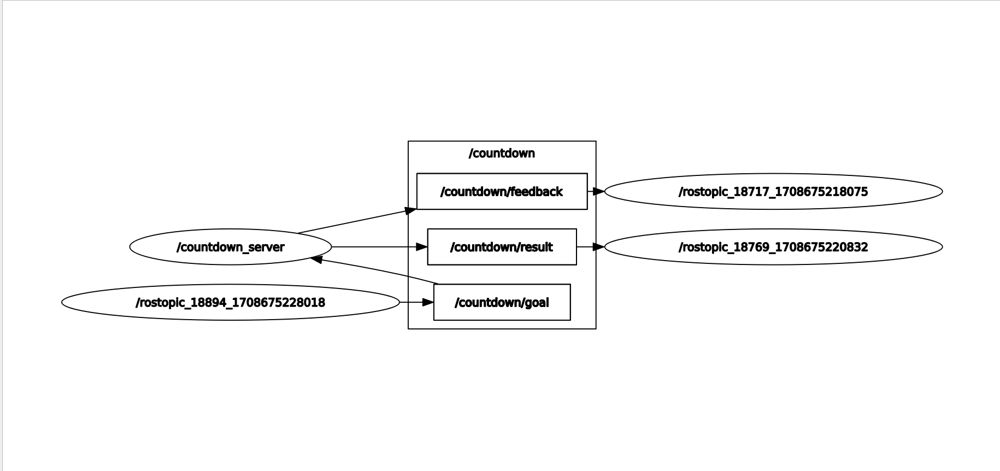
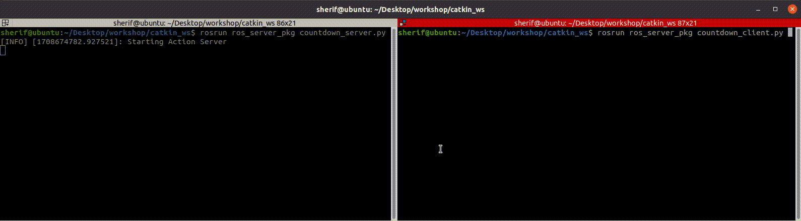
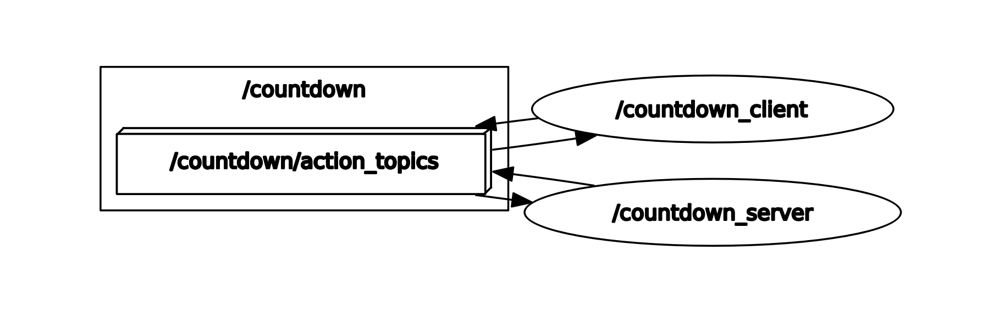

# Creating action server/client example

In this example, we will demonstrate how to create a simple countdown action . The action allows a client to send a goal specifying a starting number, and the server counts down from that number to zero, providing feedback at each step and notifying the client when the countdown is complete.

## 1- Creating custom action

### 1.1- Define a custom action

Define a service **`message`**: You need to define a service message that specifies the request and response types. Create a file named [**Countdown.action**](../service_action_examples_package/action/Countdown.action) in the [**action**](../service_action_examples_package/action) directory of your package ,and define your custom service message.

```bash
# Request
int32 starting_num
---
# Result
bool is_finished
---
# Feedback
int32 current_num

```

### 1.2- Compile the message(Update CmakeLists.txt)

Make sure your **`CMakeLists.txt`** contains the following lines to ensure that your custom message is compiled:

```Cpp
find_package(catkin REQUIRED COMPONENTS
  actionlib_msgs
  message_generation
  roscpp
  rospy
  std_msgs
)

 add_action_files(
   FILES
   Countdown.action 
 )

generate_messages(
  DEPENDENCIES
  actionlib_msgs
)
```

### 1.3- Update Package.xml

- open package.xml and add these two lines :

```xml
<depend>actionlib</depend>
<depend>actionlib_msgs</depend>
```

## 2- Creating Server and Client in Python

### 2.1. Write python server node

```py
#!/usr/bin/env python3

import rospy
import actionlib
import time
import service_action_examples_package.msg

class CountdownServer():
    # Create Feedback and Result messages
    def __init__(self):
        # Create the server
        self._action_server = actionlib.SimpleActionServer('countdown', service_action_examples_package.msg.CountdownAction, self.execute_callback, False)

        # Start the server
        self._action_server.start()
        rospy.loginfo("Starting Action Server")
  
        # Callback function to run after acknowledging a goal from the client
    def execute_callback(self, goal_handle):
        rospy.loginfo("Starting countdown…")


        result = service_action_examples_package.msg.CountdownResult()
        result.is_finished = True
        # Indicate that the goal was successful
        self._action_server.set_succeeded(result)

def main(args=None):
   # Init ROS1 and give the node a name
   rospy.init_node("countdown_server")
   countdown_server = CountdownServer()
   rospy.spin()

if __name__ == '__main__':
   main()
```

---

### 2.2- usage

1. In a Terminal window, run **`roscore`**:
   ```bash
   roscore
   ```
2. In a second Terminal window, run your action server:
   ```bash
   rosrun service_action_examples_package countdown_server.py 
   ```
3. In a third window, use **`rostopic`** pub to send a **`goal`**:
   ```bash
   rostopic pub /countdown/goal service_action_examples_package/CountdownActionGoal "header:
     seq: 0
     stamp:
       secs: 0
       nsecs: 0
     frame_id: ''
   goal_id:
     stamp:
       secs: 0
       nsecs: 0
     id: ''
   goal:
     starting_num: 4" 

   ```
4. If you wish to see the feedback and result, you will need two additional terminals. In one you will run:
   ```bash
   rostopic echo /countdown/feedback
   ```
5. And in the last one, run:
   ```bash
   rostopic echo /countdown/result
   ```

Now, when you call the server, you should see something like this:

<p align="center">


Now that we’ve verified our server is running, let’s actually count down from our goal’s starting_num:

### 2.3- update [**countdown_server.py**](../service_action_examples_package/scripts/countdown_server.py) :

```py
#!/usr/bin/env python3

import rospy
import actionlib
import time
import service_action_examples_package.msg

class CountdownServer():
    # Create Feedback and Result messages
    def __init__(self):
        # Create the server
        self._action_server = actionlib.SimpleActionServer('countdown', service_action_examples_package.msg.CountdownAction, self.execute_callback, False)

        # Start the server
        self._action_server.start()
        rospy.loginfo("Starting Action Server")
  
        # Callback function to run after acknowledging a goal from the client
    def execute_callback(self, goal_handle):
        rospy.loginfo("Starting countdown…")

        # Initiate the feedback message's current_num as the action request's starting_num
        feedback_msg = service_action_examples_package.msg.CountdownFeedback()
        feedback_msg.current_num = goal_handle.starting_num

        while feedback_msg.current_num>0:
            # Publish feedback
            self._action_server.publish_feedback(feedback_msg)


            # Print log messages
            rospy.loginfo('Feedback: {0}'.format(feedback_msg.current_num))


            # Decrement the feedback message's current_num
            feedback_msg.current_num = feedback_msg.current_num - 1

            # Wait a second before counting down to the next number
            time.sleep(1)

        self._action_server.publish_feedback(feedback_msg)
        rospy.loginfo('Feedback: {0}'.format(feedback_msg.current_num))
        rospy.loginfo('Done!')

        result = service_action_examples_package.msg.CountdownResult()
        result.is_finished = True
        # Indicate that the goal was successful
        self._action_server.set_succeeded(result)

def main(args=None):
   # Init ROS1 and give the node a name
   rospy.init_node("countdown_server")
   countdown_server = CountdownServer()
   rospy.spin()

if __name__ == '__main__':
   main()
  
```

now run it again [**Usage**](#22--usage)

<p align="center">


<p align="center">


---

### 2.4- Write python client node

 [**countdown_client.py**](../service_action_examples_package/scripts/countdown_client.py):

```py
#!/usr/bin/env python3
import rospy
import actionlib
import service_action_examples_package.msg

class CountdownClient():
    def __init__(self):
       # Initializes "countdown_client" node
       self._action_client = actionlib.SimpleActionClient("countdown", service_action_examples_package.msg.CountdownAction)

    # Waits for server to be available, then sends goal
    def send_goal(self, starting_num):
        goal_msg = service_action_examples_package.msg.CountdownGoal()
        goal_msg.starting_num = starting_num
        rospy.loginfo('Starting at: {0}'.format(starting_num))
        rospy.loginfo('Waiting for server...')

        self._action_client.wait_for_server()

        # Returns future to goal handle; client runs feedback_callback after sending the goal
        self._send_goal_future = self._action_client.send_goal(goal_msg, active_cb=self.goal_response_callback, feedback_cb=self.feedback_callback, done_cb = self.get_result_callback)

        rospy.loginfo("Goal sent!")

    # Run when client accepts goal
    def goal_response_callback(self):
        rospy.loginfo('Goal accepted :)')

   # Run when client sends feedback
    def feedback_callback(self, feedback_msg):
        rospy.loginfo('Received feedback: {0}'.format(feedback_msg.current_num))

   # Run when client sends final result
    def get_result_callback(self, state, result):
        # Show log and exit node
        rospy.loginfo('Result: {0}'.format(result.is_finished))
        rospy.signal_shutdown("Shutting-down client node")

def main(args=None):
   # Init ROS1 and give the node a name
   rospy.init_node("countdown_client")
   action_client = CountdownClient()

   # Sends goal and waits until it's completed
   action_client.send_goal(10)
   rospy.spin()

if __name__ == '__main__':
   main()
```

---

You can see the **`countdown_server`** using the following command lines:

```bash
rosrun service_action_examples_package countdown_server.py 
```

You can see the **`countdown_client`** using the following command lines:

```bash
rosrun service_action_examples_package countdown_client.py 
```

Now, when you call the server and client, you should see something like this:

<p align="center">


<p align="center">


## 3- Creating Server and Client in cpp

### 3.1. Write Cpp server node

[**countdown_server.cpp**](../service_action_examples_package/src/countdown_server.cpp)

```cpp
#include <ros/ros.h>
#include <actionlib/server/simple_action_server.h>
#include <service_action_examples_package/CountdownAction.h>
#include <unistd.h>

void executeCallback(const service_action_examples_package::CountdownGoalConstPtr &goal, 
                     actionlib::SimpleActionServer<service_action_examples_package::CountdownAction> *as) {
    ros::Rate r(1);
    service_action_examples_package::CountdownFeedback feedback;
    feedback.current_num = goal->starting_num;

    while (feedback.current_num > 0) {
        // Publish feedback
        as->publishFeedback(feedback);

        // Print log messages
        ROS_INFO("Feedback: %d", feedback.current_num);

        // Decrement the feedback message's current_num
        feedback.current_num -= 1;

        // Wait a second before counting down to the next number
        r.sleep();
    }

    // Final feedback message
    as->publishFeedback(feedback);
    ROS_INFO("Feedback: %d", feedback.current_num);
    ROS_INFO("Done!");

    service_action_examples_package::CountdownResult result;
    result.is_finished = true;
    // Indicate that the goal was successful
    as->setSucceeded(result);
}

int main(int argc, char** argv) {
    ros::init(argc, argv, "countdown_server_cpp");
    ros::NodeHandle nh;

    actionlib::SimpleActionServer<service_action_examples_package::CountdownAction> server(nh, "countdown", 
            boost::bind(&executeCallback, _1, &server), false);

    server.start();
    ROS_INFO("Starting Action Server cpp");
    ros::spin();

    return 0;
}

```

### 3.1. Write Cpp client node

[**countdown_client.cpp**](../service_action_examples_package/src/countdown_client.cpp)

```cpp
#include <ros/ros.h>
#include <actionlib/client/simple_action_client.h>
#include <service_action_examples_package/CountdownAction.h>

// This callback function will be called when feedback is received from the action server
void feedbackCallback(const service_action_examples_package::CountdownFeedbackConstPtr& feedback) {
    ROS_INFO("Feedback: %d", feedback->current_num);
}

// This callback function will be called when the action becomes active
void activeCallback() {
    ROS_INFO("Goal just went active");
}

// This callback function will be called when the action is done
void doneCallback(const actionlib::SimpleClientGoalState& state,
                  const service_action_examples_package::CountdownResultConstPtr& result) {
    ROS_INFO("Action finished: %s", state.toString().c_str());
    ROS_INFO("Result: %d", result->is_finished);
}

int main(int argc, char** argv) {
    ros::init(argc, argv, "countdown_client_cpp");

    if (argc != 2) {
        ROS_INFO("Usage: countdown_client <starting_num>");
        return 1;
    }

    int starting_num = atoi(argv[1]);

    actionlib::SimpleActionClient<service_action_examples_package::CountdownAction> client("countdown", true);

    ROS_INFO("Waiting for action server to start.");
    client.waitForServer();

    service_action_examples_package::CountdownGoal goal;
    goal.starting_num = starting_num;

    ROS_INFO("Sending goal: %d", starting_num);
    client.sendGoal(goal, &doneCallback, &activeCallback, &feedbackCallback);

    // Wait for the action to return
    bool finished_before_timeout = client.waitForResult(ros::Duration(30.0));

    if (!finished_before_timeout) {
        ROS_INFO("Action did not finish before the timeout.");
    }

    return 0;
}

```

## 4- Reference

[ROS Actions](https://foxglove.dev/blog/creating-ros1-actions)

## [↩Back to main](../ros_services_and_action.md)