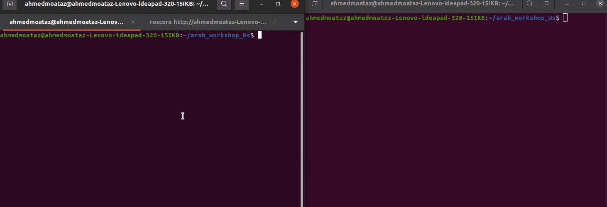

# Task: ROS Action

Before you begin this task, please try to write a similar example in a workshop or on your own. If you succeed in writing it without referring back to the example code, you're ready to start the task.

## Task 4

### Description
Write a ROS Action {goal: 'goal_encoder_count',result: 'final_encoder_count',feedback: 'current_encoder_count'} from client send specific goal encoder count and from server the feedback intial = 0 and increase by 1 every 0.2 sec and when feadback == goal encoder return result 



don't see any of tips before you try with yourself and tired from searching  

#### Tips for Action
<details>
<summary><b>First Tip</b></summary>
make sure in `CMakeLists` 

1- in find_package : `message_generation` and `actionlib_msgs`

```bash
find_package(catkin REQUIRED COMPONENTS
  roscpp
  rospy
  actionlib_msgs 
  std_msgs
  message_generation 

)
```
2- in add_action_files: name the file in action folder

```bash
add_action_files(
  FILES
  motor_action.action
)
```

3- generate_messages: not commmented and `actionlib_msgs` 

```bash
generate_messages(
  DEPENDENCIES
  actionlib_msgs
  std_msgs
)
```
make sure in `package.xml` you add
```bash
  <build_depend>message_generation</build_depend>
  <exec_depend>message_runtime</exec_depend>

```
</details>

#### Tips for using Action client
<details>
<summary><b>second Tip</b></summary>
1- import action from your package and don't forget your_actionAction, your_actionGoal

`from your_package.msg import file_name_from_action_folder your_actionAction, your_actionGoal` 

```py
from  custom_action_task_pkg.msg import motor_actionAction, motor_actionGoal

```

</details>

#### Tips for using Action server

<details>
<summary><b>Third Tip</b></summary>

1- import action from your package and don't forget your_actionAction, your_actionResult, your_actionFeedback

`from your_package.msg import file_name_from_action_folder your_actionAction, your_actionGoal, your_actionFeedback` 

```py
from  custom_action_task_pkg.msg import motor_actionAction, motor_actionResult, motor_actionFeedback

```

</details>


<details>
<summary><b>Forth Tip (Do not open until the last breath)</b></summary>

- implementation for motor execute method

```py
    def execute_motor(self, goal):
        feedback = motor_actionFeedback()
        result = motor_actionResult()

        # Initialize variables
        ticks = 0
        rate = rospy.Rate(5)  # 5 Hz
        success = False

        # Main loop to increment ticks and publish feedback
        while not rospy.is_shutdown():
            ticks += 1
            feedback.current_encoder_count = ticks
            
            self.motor_action_server.publish_feedback(feedback)
            rospy.loginfo("feadback now is:  " + str(feedback.current_encoder_count))
            if ticks >= goal.goal_encoder_count:
                success = True
                break

            rate.sleep()

        if success:
            result.final_encoder_count = ticks
            rospy.loginfo("Server: motor move completed")
            self.motor_action_server.set_succeeded(result)
        else:
            self.motor_action_server.set_aborted()

```

</details>

[for full package ](custom_action_task_pkg)

## [↩Back to main](../../ros_services_and_action.md)