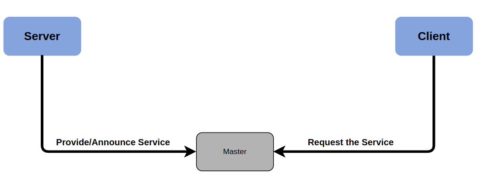
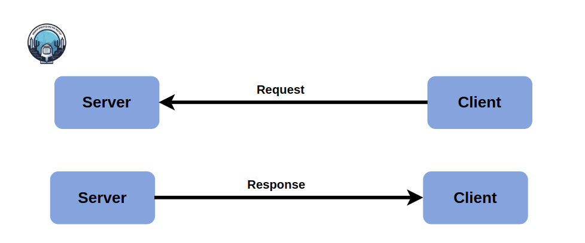
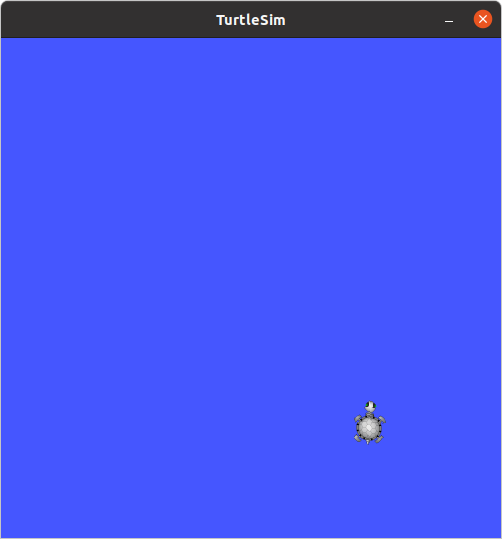
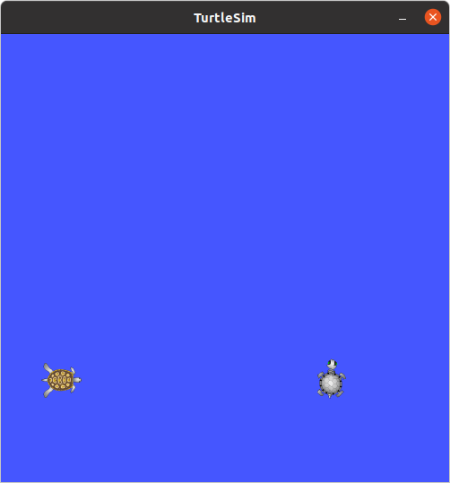
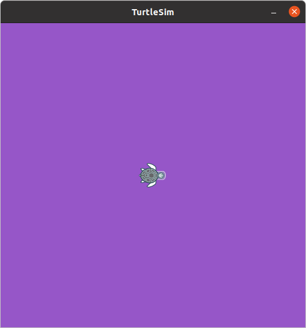
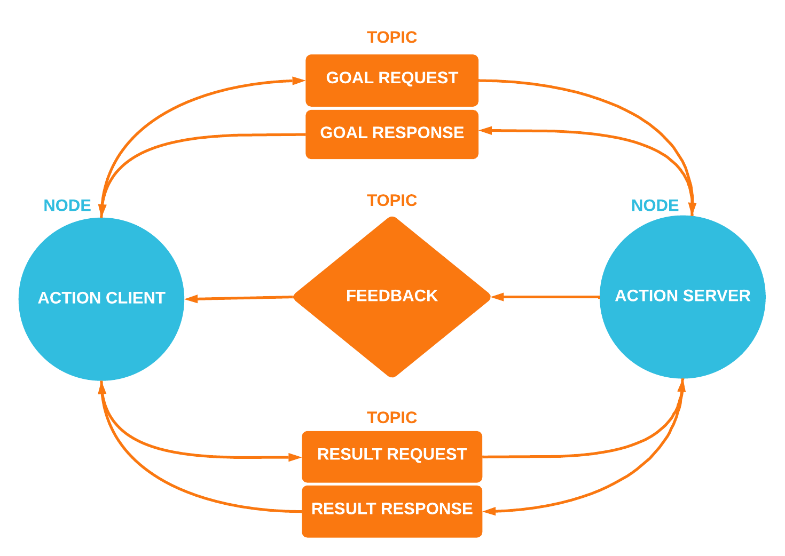

# ROS Services

Author:

Review :

## 1. Introduction

- A ROS **`service`** is a way for nodes in a ROS system to **`request`** and **`receive`** information from other nodes.
- Services are defined using the ROS service definition language and are similar to messages in that they are simple data structures, but they include a request and a response message.
- When a client node sends a service request to a server node, the server node processes the request and sends back a response. The request and response messages contain specific fields defined in the service definition file. This mechanism enables synchronous communication between nodes, where one node can directly query another and receive a reply.
- Communication on service is bidirectional synchronous communication between the service client requesting a service and the service server responding to the request. Unlike topics, services have no publishers or subscribers.

<p align="center">


## **2. Service Servers and Clients**

- The **server** listens for incoming communications. Upon receiving a request, it computes the necessary operations and sends back the response to the service.
- The **client** sends a request to the service and then waits for the response, **blocking** the terminal from performing other actions until the response is received. **(Unlike actions, which are asynchronous and allow you to perform additional commands while they are in progress, services operate synchronously.)**

<p align="center"> 

<p align="center"> 

### 2.1. Service Files

The message types used with services are derived from the eligible .msg types, as discussed in the previous section of this workshop. However, service messages are defined in a specialized file format known as a **.srv** file.

#### **Eligible Service Field Types**

Exactly the same as messages!

Service files are essentially two message files combined into one!

```
 Eligible message field types:
 - int8, int16, int32, int64 (plus uint*)
 - float32, float64
 - string
 - time, duration
 - other msg files
 - variable-length array[] and fixed-length array[C]
 - the special Header type
```

#### **Example .srv file**

A .srv file is **similar** (it's just two message files smushed into one, one request, one response.)

The sections are separated by three dashes. It has to be done this way.

```
request
---
response
```

Example:

```
int64 A
int64 B
---
int64 Sum
```

### 2.2. Command Line

ROS has two command-line tools to work with services, **`rossrv`** and **`rosservice`** .

> NOTE: `rosservice` is **different** from `rossrv`, which does the same thing that `rosmsg` does for .srv files.

You can use `rosservice` in the same way `rostopic` is used to publish and subscribe to topics, except now you're **calling the service.**
With rossrv , we can see information about the services data structure,With rosservice , we can list and query services. The commands supported are as follows:

- **List available services :**

```
$ rosservice list
```

- **Show the type of the service (what messages it takes)**

```
$ rosservice type /service_name
```

- **Call a service**

```
$ rosservice call /service_name 
```

- **Print service arguments**

```
$ rosservice args /service
```

- **find services by the service type**

```
rosservice find msg-type
```

- **print information about the service**

```
rosservice info /service
```

- **print the service type**

```
rosservice type /service
```

- **prints the service ROSRPC URI**

```
rosservice uri /service
```

### 2.3. Some Practice

We are going to list the services available for the **`turtlesim`** node by using the following code, so if it is not working, run **`roscore`** and **`run`** the **`turtlesim`** node:

```bash
rosservice list
```

Now, You are expected to see the following output:

```bash
/clear
/kill
/reset
/rosout/get_loggers
/rosout/set_logger_level
/spawn
/turtle1/set_pen
/turtle1/teleport_absolute
/turtle1/teleport_relative
/turtlesim/get_loggers
/turtlesim/set_logger_level
```

If you want to see the type of any service, for example, the **/clear service**, use:

```bash
rosservice type /clear
```

You will then obtain:

```bash
std_srvs/Empty
```

To invoke a service, you will use **rosservice call [service] [args]** . If you want
to invoke the `/clear` service, use:

```bash
rosservice call /clear
```

In the `turtlesim` window, you will now see that the `lines` created by the movements
of the turtle will be `deleted`.

<p align="center">


Now, we are going to try another service, for example, the `/spawn` service. This
service will `create` another turtle in another location with a different orientation.

To start with, we are going to see the following type of message:

```bash
rosservice type /spawn | rossrv show
```

We will then obtain the following:

```bash
float32 x
float32 y
float32 theta
string name
---
string name
```

With these fields, we know how to invoke the service. We need the positions of
x and y, the orientation (theta), and the name of the new turtle:

```bash
rosservice call /spawn 1.5 2.5 0.0 "new_turtle_2"
```

We then obtain the following result:

<p align="center">


## 3. Using the Parameter Server

The Parameter Server is used to store data that is accessible by all the nodes.

ROS has a tool to manage the Parameter Server called rosparam . The accepted parameters are as follows:

```shell
$ **rosparam set parameter** value
# This sets the parameter

$ rosparam get parameter
# This gets the parameter

$ rosparam load file
# This loads parameters from the file

$ rosparam dump file
# This dumps parameters to the file

$ rosparam delete parameter
# This deletes the parameter

$ rosparam list
# This lists the parameter names

```

For example, we can see the parameters in the server that are used by all the nodes:

```bash
rosparam list
```

We obtain the following output:

```bash
/rosdistro
/roslaunch/uris/host_ubuntu__37307
/rosversion
/run_id
/turtlesim/background_b
/turtlesim/background_g
/turtlesim/background_r
```

The `background` parameters are of the `turtlesim` node.
These parameters change the color of the windows that are initially blue. If you want to read a value, you will
use the get parameter:

```bash
rosparam get /turtlesim/background_r
```

To set a new value, you will use the set parameter:

```bash
rosparam set /turtlesim/background_r 150 
```

We then obtain the following result:

<p align="center">


## 4. [Exmaple For Creating custom services](source/exmaple_custom_services.md)

---

### 4.1. [Service Task](source/task_custom_service/Task_service.md)

---

#### Note : Refresher on `argv`

`sys.argv` is a list in Python that holds the command-line arguments passed to a script. It is based on the `argc` and `argv` concept from C++ (argument count and argument vector).

Here's how `sys.argv` works:

* The **first** element, `sys.argv[0]`, is the name of the script being executed.
* The elements **beyond** the first (i.e., `sys.argv[1]`, `sys.argv[2]`, etc.) are the arguments provided to the script, listed in the order they were given.

This is why, in the ROS Python service example, you see references to `sys.argv[1]`, `sys.argv[2]`, etc., to access the command-line arguments passed to the script.

# ROS Actions

## 1. Introduction

- A ROS action is just like a ROS service, a special kind of topic that allows for two-way communication between nodes. But with some valuable, and notable differences.
- ROS **`action`** provides a way for nodes to perform long-running tasks asynchronously and to receive updates about the progress of these tasks. Actions are suitable for tasks that may take a significant amount of time and where the client may need to check on the status or cancel the request if needed.

* Actions are defined using the ROS action definition language and involve three types of messages: goal, feedback, and result. These messages are used to represent the goal of the action, provide feedback on the progress, and deliver the final result.
* When a client node sends an action goal to a server node, the server processes the goal and periodically sends feedback to the client about the progress of the action. Once the action is completed, the server sends the final result back to the client. This mechanism allows for asynchronous communication where the client can continue performing other tasks while waiting for the action to complete.
* Actions support preemption and cancellation, meaning that the client can cancel an ongoing action if necessary. This is a key feature that differentiates actions from **services**, which provide **synchronous** communication without such ongoing feedback or cancellation capabilities.

### Action Server:

An action server is a ROS node that implements an action. It:

* Receives goal requests from clients.
* Executes the tasks and provides periodic feedback.
* Sends the final result once the task is complete.

It can handle multiple requests concurrently, allowing simultaneous task execution.

### Action Client:

An action client is a node responsible for requesting and managing actions from an action server.

- It sends a goal to the action server, specifying the task to be executed.
- During the action's execution, the client receives periodic feedback from the server, allowing it to monitor the progress.
- Once the action is completed, the client receives the final result from the server.

The action client operates asynchronously, allowing it to continue other tasks while waiting for the action to complete, thus enabling efficient interaction with the action server.

<p align="center">


**Action Topics**

The Action topic is special, because it consists of 5 topics under its namespace:

- **/goal**
  - You send the desired goal to trigger the action here
- **/cancel**
  - You send a cancel signal to stop the action execution
- **/status**
  - Shows the status of the action server
- **/result**
  - Shows any end state messages from action execution
- **/feedback**
  - Shows any running messages during action execution

#### **Action Servers and Clients**

An action is facillitated by two types of nodes:

- The action **server** advertises the action topic, and listens for messages sent to the /goal or /cancel
  - When a valid goal is sent to /goal, it triggers the action server to execute the action it is programmed to carry out, changing its status
  - In the midst of executing that action, it constantly publishes to /feedback, giving information of the proceedings
  - Upon completion, error, or a stop command (pre-empt) (eg. a command sent to /cancel, which clears the goal on /goal), the action concludes, and publishes to /result the appropriate result message
- The action **client** publishes to the action topic
  - Then, it can poll the /feedback, /status, and /goal topics to get information of the proceedings of the action execution.
  - The client is able to continue with its program flow because action calls are not blocking (action calls are asynchronous), as opposed to service calls which are blocking.

#### **Goal, Feedback, and Result**

<p align="center">
  
</p>

> **Goal**
> To accomplish tasks using actions, we introduce the notion of a goal that can be sent to an ActionServer by an ActionClient. In the case of moving the base, the goal would be a PoseStamped message that contains information about where the robot should move to in the world. For controlling the tilting laser scanner, the goal would contain the scan parameters (min angle, max angle, speed, etc).
>
> **Feedback**
> Feedback provides server implementers a way to tell an ActionClient about the incremental progress of a goal. For moving the base, this might be the robot's current pose along the path. For controlling the tilting laser scanner, this might be the time left until the scan completes.
>
> **Result**
> A result is sent from the ActionServer to the ActionClient upon completion of the goal. This is different than feedback, since it is sent exactly once. This is extremely useful when the purpose of the action is to provide some sort of information. For move base, the result isn't very important, but it might contain the final pose of the robot. For controlling the tilting laser scanner, the result might contain a point cloud generated from the requested scan.
>
> (Source: http://wiki.ros.org/actionlib)

### 5.2 Action Files `<a name="5.2"></a>`

The message types available for use with actions are based off of the eligible .msg types, just like servces are.

But the action messages are defined in a special type of file called a .action file.

#### **Eligible Action Field Types**

Action files are just three message files 'smushed' into one! (As opposed to service files' two.)

> Eligible message field types
>
> - int8, int16, int32, int64 (plus uint*)
> - float32, float64
> - string
> - time, duration
> - other msg files
> - variable-length array[] and fixed-length array[C]
> - the special Header type

#### **Example .action file**

```
  Header header
  string child_frame_id
  geometry_msgs/PoseWithCovariance pose
  geometry_msgs/TwistWithCovariance twist
```

An .action file is **similar** (it's just three message files smushed into one, goal, result, feedback)

Again, the sections are separated by three dashes!

```
goal
---
result
---
feedback
```

Eg:

```
#goal definition
int32 order
---
#result definition
int32[] sequence
---
#feedback
int32[] sequence
```

### 5.3 rostopic for Actions `<a name="5.3"></a>`

ROS has no special command line interface for interacting with actions. Do it via `rostopic`

```shell
# List available actions
# Look for the /goal, /cancel, /status, /result, /feedback pattern
$ rostopic list

# Show the type of the service (what messages it takes)
$ rostopic type /action_topic

# Call a service
# Just publish the goal!
$ rostopic pub /action_topic/goal goal_msg_type [CONTENT]
```

#### **Actionlib Ax GUI Tools**

There's a handy GUI client if you really want to use it. But using rostopic is probably better...

```shell
# Client
$ rosrun actionlib axclient.py

# Server
$ rosrun actionlib axserver.py
```

### 5.4 Creating Action Files `<a name="5.4"></a>`

Source: http://wiki.ros.org/actionlib_tutorials/Tutorials

Ok, you now know the drill, Let's get to writing an action file.

Create a package called `simple_action_example`. We'll make more later on, but for now let's just run this through for the simple example! We're going to do a fibonacci number calculator!

**1. Go to your package directory**

```shell
$ roscd simple_action_example
$ mkdir action # Make a srv folder to keep your service files

$ cd action
$ touch Fibonacci.action # Capitalising the first letter is the convention!
```

**2. Then open that .msg file in your favourite text editor** and HAVE AT IT! (Write your data types and names)

Make the Fibonacci action!

```
#goal definition
int32 order
---
#result definition
int32[] sequence
---
#feedback
int32[] sequence
```

**3. Then go to package.xml** and **append these two lines**

```xml
  <build_depend>message_generation</build_depend>
  <exec_depend>message_runtime</exec_depend>
```

**4. Then say hello to our ~~nemesis~~ good old friend CMakeLists.txt**

Ensure these lines are present (**IN ORDER!**)

> Note: This is if you want to generate action messages. But if you want to use actionlib, check the appropriate section in 4.5

```cmake
find_package(catkin REQUIRED COMPONENTS
   roscpp
   rospy
   actionlib_msgs # <-- Add this
   # Notice there's no message_generation, this is because it's implied by actionlib_msgs
)

# Uncomment this block
add_action_files(
  DIRECTORY action
  FILES Fibonacci.action
)

# Uncomment this block (even though you're generating services)
generate_messages(
  DEPENDENCIES
  actionlib_msgs
  std_msgs # And any other message packages you're using
)

catkin_package(
  CATKIN_DEPENDS roscpp actionlib_msgs <and your other catkin dependencies> # <-- Add this 
)
```

**5. Then go back to your workspace root, and rebuild!**

```shell
$ roscd simple_action_example
$ cd ../..
$ catkin_make # or catkin_make install, see what works
```

If you built this, you should find that in devel/include/simple_action_example, that there are 10 files that were created.

```
FibonacciActionFeedback.h  FibonacciAction.h        FibonacciFeedback.h  FibonacciResult.h
FibonacciActionGoal.h      FibonacciActionResult.h  FibonacciGoal.h
```

Pretty cool!

### 5.5 Writing Simple Action Nodes `<a name="5.5"></a>`

Source: http://wiki.ros.org/actionlib_tutorials/Tutorials

Check the minimal packages for implementation.

#### **rospy server** `<a name="5.5.1"></a>`

```python
#! /usr/bin/env python

import rospy
import actionlib
import simple_action_example.msg

# Create the action server as a class
# The object is just in-case Python 2 is being used to interpret this
# https://stackoverflow.com/questions/54867/what-is-the-difference-between-old-style-and-new-style-classes-in-python
class FibonacciAction(object):
    # Create the Feedback and Result messages
    _feedback = simple_action_example.msg.FibonacciFeedback()
    _result = simple_action_example.msg.FibonacciResult()

    # Constructor
    def __init__(self, name):
        self._action_name = name
  
        # Hook callbacks
        self._as = actionlib.SimpleActionServer(self._action_name, 
                                                simple_action_example.msg.FibonacciAction, 
                                                execute_cb=self.execute_cb, 
                                                auto_start = False)
  
        # Start the action server
        self._as.start()

    # Goal execution callback
    def execute_cb(self, goal):
        # helper variables
        r = rospy.Rate(1)
        success = True
  
        # append the seeds for the fibonacci sequence
        self._feedback.sequence = []
        self._feedback.sequence.append(0)
        self._feedback.sequence.append(1)
  
        # Publish info
        rospy.loginfo('%s: Executing, creating fibonacci sequence of order %i with seeds %i, %i' % (self._action_name, goal.order, self._feedback.sequence[0], self._feedback.sequence[1]))
  
        # Execute the action
        for i in range(1, goal.order):
            # Check that preempt has not been requested by the client
            # If yes, kill the action
            if self._as.is_preempt_requested():
                rospy.loginfo('%s: Preempted' % self._action_name)
                self._as.set_preempted()
                success = False
                break
  
            self._feedback.sequence.append(self._feedback.sequence[i] + self._feedback.sequence[i-1])
  
            # publish the feedback
            self._as.publish_feedback(self._feedback)
  
            # this step is not necessary, the sequence is computed at 1 Hz for demonstration purposes
            r.sleep()
  
        if success:
            self._result.sequence = self._feedback.sequence
            rospy.loginfo('%s: Succeeded' % self._action_name)
            self._as.set_succeeded(self._result)
  
if __name__ == '__main__':
    rospy.init_node('fibonacci')
    server = FibonacciAction(rospy.get_name())
    rospy.spin()
```

#### **rospy client**

```python
#! /usr/bin/env python

from __future__ import print_function # Lets you print like Python 3
import rospy
import actionlib
import simple_action_example.msg

def fibonacci_client():
    # SimpleActionClient construction, targeting the fibonacci topic of type Fibonacci
    client = actionlib.SimpleActionClient('fibonacci', 
                                          simple_action_example.msg.FibonacciAction)

    # Waits until the action server has started up and started
    # listening for goals. (So the goals aren't ignored.)
    client.wait_for_server()

    # Creates a goal to send to the action server.
    goal = simple_action_example.msg.FibonacciGoal(order=20)

    # Sends the goal to the action server.
    client.send_goal(goal)

    # Waits for the server to finish performing the action.
    client.wait_for_result()

    # Prints out the result of executing the action
    return client.get_result()  # A FibonacciResult

if __name__ == '__main__':
    try:
        # Initializes a rospy node so that the SimpleActionClient can
        # publish and subscribe over ROS.
        rospy.init_node('fibonacci_client_py')
        result = fibonacci_client()
  
        print("Result:", ', '.join([str(n) for n in result.sequence]))
    except rospy.ROSInterruptException:
        print("program interrupted before completion", file=sys.stderr)
```

#### **roscpp server** `<a name="4.5.2"></a>`

```c++
#include <ros/ros.h>
#include <actionlib/server/simple_action_server.h>
#include <simple_action_example/FibonacciAction.h>

class FibonacciAction
{
protected:

  ros::NodeHandle nh_;

  // NodeHandle instance must be created before this line. Otherwise strange error occurs.
  actionlib::SimpleActionServer<simple_action_example::FibonacciAction> as_;
  std::string action_name_;

  // create messages that are used to published feedback/result
  simple_action_example::FibonacciFeedback feedback_;
  simple_action_example::FibonacciResult result_;

public:

  // Our constructor (with a cool initialisation list!)
  // https://stackoverflow.com/questions/2785612/c-what-does-the-colon-after-a-constructor-mean
  FibonacciAction(std::string name) :
    // Bind the callback to the action server. False is for thread spinning
    as_(nh_, name, boost::bind(&FibonacciAction::executeCB, this, _1), false),
    action_name_(name)
  {
    // Start the action server
    as_.start();
  }

  // Destructor
  ~FibonacciAction(void)
  {
  }

  // Execute action callback (passing the goal via reference)
  void executeCB(const simple_action_example::FibonacciGoalConstPtr &goal)
  {
    // helper variables
    ros::Rate r(1);
    bool success = true;

    // push_back the seeds for the fibonacci sequence
    feedback_.sequence.clear();
    feedback_.sequence.push_back(0);
    feedback_.sequence.push_back(1);

    // publish info to the console for the user
    ROS_INFO("%s: Executing, creating fibonacci sequence of order %i with seeds %i, %i", action_name_.c_str(), goal->order, feedback_.sequence[0], feedback_.sequence[1]);

    // start executing the action (i <= goal->order, as goal is a pointer)
    for(int i=1; i<=goal->order; i++)
    {
      // check that preempt has not been requested by the client
      if (as_.isPreemptRequested() || !ros::ok())
      {
        ROS_INFO("%s: Preempted", action_name_.c_str());
        // set the action state to preempted
        as_.setPreempted();
        success = false;
        break;
      }

      // Add the number to the feedback to be fed back
      feedback_.sequence.push_back(feedback_.sequence[i] + feedback_.sequence[i-1]);
      // publish the feedback
      as_.publishFeedback(feedback_);
      // this sleep is not necessary, the sequence is computed at 1 Hz for demonstration purposes
      r.sleep();
    }

    if(success)
    {
      result_.sequence = feedback_.sequence;
      ROS_INFO("%s: Succeeded", action_name_.c_str());
      // set the action state to succeeded
      as_.setSucceeded(result_);
    }
  }
};


int main(int argc, char** argv)
{
  ros::init(argc, argv, "fibonacci");

  // Create an action server object and spin ROS
  FibonacciAction fibonacci("fibonacci");
  ros::spin();

  return 0;
}
```

#### **roscpp client**

```c++
#include <ros/ros.h>
#include <actionlib/client/simple_action_client.h>
#include <actionlib/client/terminal_state.h>
#include <simple_action_example/FibonacciAction.h>

int main (int argc, char **argv)
{
  // Init ROS node called test_fibonacci
  ros::init(argc, argv, "test_fibonacci");

  // create the action client
  // true causes the client to spin its own thread
  actionlib::SimpleActionClient<simple_action_example::FibonacciAction> ac("fibonacci", true);

  ROS_INFO("Waiting for action server to start.");
  // wait for the action server to start
  ac.waitForServer(); //will wait for infinite time

  ROS_INFO("Action server started, sending goal.");
  // send a goal to the action
  simple_action_example::FibonacciGoal goal;
  goal.order = 20;
  ac.sendGoal(goal);

  //wait for the action to return
  bool finished_before_timeout = ac.waitForResult(ros::Duration(30.0));

  if (finished_before_timeout)
  {
    actionlib::SimpleClientGoalState state = ac.getState();
    ROS_INFO("Action finished: %s",state.toString().c_str());
  }
  else
    ROS_INFO("Action did not finish before the time out.");

  //exit
  return 0;
}
```

#### **roscpp CMakelists setup**

Example minimal file from the tutorials:

```python
cmake_minimum_required(VERSION 2.8.3)
project(simple_action_example)

find_package(catkin REQUIRED COMPONENTS roscpp actionlib actionlib_msgs)

# Since we added Boost
find_package(Boost REQUIRED COMPONENTS system)

add_action_files(
  DIRECTORY action
  FILES Fibonacci.action
)

generate_messages(
  DEPENDENCIES actionlib_msgs std_msgs
)

catkin_package(
  CATKIN_DEPENDS actionlib_msgs
)

include_directories(include ${catkin_INCLUDE_DIRS} ${Boost_INCLUDE_DIRS})

# Link the node
add_executable(fibonacci_server src/fibonacci_server.cpp)

target_link_libraries(
  fibonacci_server
  ${catkin_LIBRARIES}
)

add_dependencies(
  fibonacci_server
  # The one below is the name of your package!!
  ${simple_action_example_EXPORTED_TARGETS}
)

# Link the node
add_executable(fibonacci_client src/fibonacci_client.cpp)

target_link_libraries(
  fibonacci_client
  ${catkin_LIBRARIES}
)

add_dependencies(
  fibonacci_client
  # The one below is the name of your package!!
  ${simple_action_example_EXPORTED_TARGETS}
)
```

#### **Testing your action**

Easy! But remember that **you will need to echo the /feedback topic to see anything worthwhile!**

If you want to self-publish a goal, remember to send it with a header and goal ID!

```bash
# Terminal 1
$ roscore

# Terminal 2
$ rosrun simple_action_example fibonacci_server

# Terminal 3
$ rosrun simple_action_example fibonacci_client

# Then just echo the topics using rostopic echo /fibonacci/???
# And view the graph (using rqt_graph) if you want to!
```

### [Exmaple To Creating action server/clients](/source/example_action.md)

---

### [Action Task](source/task_custom_action/Task_action.md)
