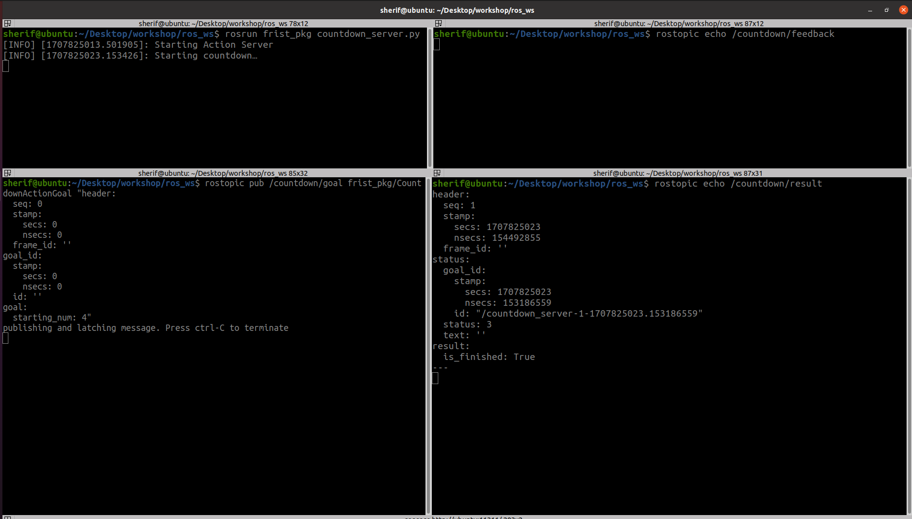
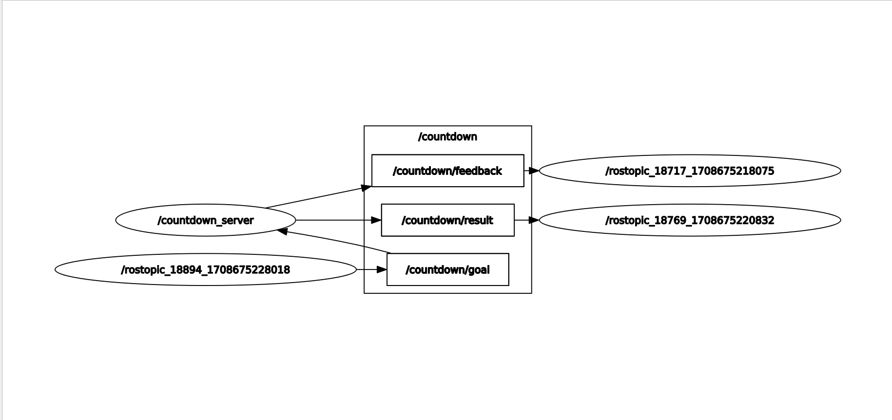
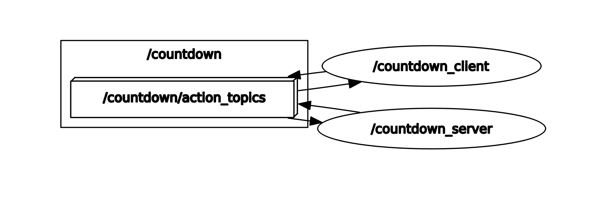

# Creating action server/clients
## 1- Define a custom action services :
Define a service **`message`**: You need to define a service message that specifies the request and response types. Create a file named [**Countdown.action**](../ros_server_pkg/action/Countdown.action) in the [**action**](../ros_server_pkg/action) directory of your package ,and define your custom service message.


```bash
# Request
int32 starting_num
---
# Result
bool is_finished
---
# Feedback
int32 current_num

```
### 2- Compile the message
Make sure your **`CMakeLists.txt`** contains the following lines to ensure that your custom message is compiled:

```Cpp
find_package(catkin REQUIRED COMPONENTS
  actionlib_msgs
  message_generation
  roscpp
  rospy
  std_msgs
)

 add_action_files(
   FILES
   Countdown.action 
 )

generate_messages(
  DEPENDENCIES
  actionlib_msgs
)
```

### 3-Write action server 
countdown_server.py

```py
#!/usr/bin/env python3

import rospy
import actionlib
import time
import ros_server_pkg.msg

class CountdownServer():
    # Create Feedback and Result messages
    def __init__(self):
        # Create the server
        self._action_server = actionlib.SimpleActionServer('countdown', ros_server_pkg.msg.CountdownAction, self.execute_callback, False)

        # Start the server
        self._action_server.start()
        rospy.loginfo("Starting Action Server")
    
        # Callback function to run after acknowledging a goal from the client
    def execute_callback(self, goal_handle):
        rospy.loginfo("Starting countdown…")


        result = ros_server_pkg.msg.CountdownResult()
        result.is_finished = True
        # Indicate that the goal was successful
        self._action_server.set_succeeded(result)

def main(args=None):
   # Init ROS1 and give the node a name
   rospy.init_node("countdown_server")
   countdown_server = CountdownServer()
   rospy.spin()

if __name__ == '__main__':
   main()
```
---
##  usage
1. In a Terminal window, run **`roscore`**:
    ```bash
    roscore
    ```
2. In a second Terminal window, run your action server:
    ```bash
    rosrun ros_server_pkg countdown_server.py 
    ```
3. In a third window, use **`rostopic`** pub to send a **`goal`**:
    ```bash
    rostopic pub /countdown/goal ros_server_pkg/CountdownActionGoal "header:
      seq: 0
      stamp:
        secs: 0
        nsecs: 0
      frame_id: ''
    goal_id:
      stamp:
        secs: 0
        nsecs: 0
      id: ''
    goal:
      starting_num: 4" 

    ```
4. If you wish to see the feedback and result, you will need two additional terminals. In one you will run:
    ```bash
    rostopic echo /countdown/feedback
    ```
5. And in the last one, run:
    ```bash
    rostopic echo /countdown/result
    ```
Now, when you call the server, you should see something like this:


<p align="center">


Now that we’ve verified our server is running, let’s actually count down from our goal’s starting_num:

now update [**countdown_server.py**](../ros_server_pkg/script/countdown_server.py):
```py
#!/usr/bin/env python3

import rospy
import actionlib
import time
import ros_server_pkg.msg

class CountdownServer():
    # Create Feedback and Result messages
    def __init__(self):
        # Create the server
        self._action_server = actionlib.SimpleActionServer('countdown', ros_server_pkg.msg.CountdownAction, self.execute_callback, False)

        # Start the server
        self._action_server.start()
        rospy.loginfo("Starting Action Server")
    
        # Callback function to run after acknowledging a goal from the client
    def execute_callback(self, goal_handle):
        rospy.loginfo("Starting countdown…")

        # Initiate the feedback message's current_num as the action request's starting_num
        feedback_msg = ros_server_pkg.msg.CountdownFeedback()
        feedback_msg.current_num = goal_handle.starting_num

        while feedback_msg.current_num>0:
            # Publish feedback
            self._action_server.publish_feedback(feedback_msg)


            # Print log messages
            rospy.loginfo('Feedback: {0}'.format(feedback_msg.current_num))


            # Decrement the feedback message's current_num
            feedback_msg.current_num = feedback_msg.current_num - 1

            # Wait a second before counting down to the next number
            time.sleep(1)

        self._action_server.publish_feedback(feedback_msg)
        rospy.loginfo('Feedback: {0}'.format(feedback_msg.current_num))
        rospy.loginfo('Done!')

        result = ros_server_pkg.msg.CountdownResult()
        result.is_finished = True
        # Indicate that the goal was successful
        self._action_server.set_succeeded(result)

def main(args=None):
   # Init ROS1 and give the node a name
   rospy.init_node("countdown_server")
   countdown_server = CountdownServer()
   rospy.spin()

if __name__ == '__main__':
   main()
        
```
 
now run it again [**Usage**](#usage)

<p align="center">


<p align="center">


---

### 4-Write action clients
 [**countdown_client.py**](../ros_server_pkg/script/countdown_client.py):

```py
#!/usr/bin/env python3
import rospy
import actionlib
import ros_server_pkg.msg

class CountdownClient():
    def __init__(self):
       # Initializes "countdown_client" node
       self._action_client = actionlib.SimpleActionClient("countdown", ros_server_pkg.msg.CountdownAction)

    # Waits for server to be available, then sends goal
    def send_goal(self, starting_num):
        goal_msg = ros_server_pkg.msg.CountdownGoal()
        goal_msg.starting_num = starting_num
        rospy.loginfo('Starting at: {0}'.format(starting_num))
        rospy.loginfo('Waiting for server...')

        self._action_client.wait_for_server()

        # Returns future to goal handle; client runs feedback_callback after sending the goal
        self._send_goal_future = self._action_client.send_goal(goal_msg, active_cb=self.goal_response_callback, feedback_cb=self.feedback_callback, done_cb = self.get_result_callback)

        rospy.loginfo("Goal sent!")

    # Run when client accepts goal
    def goal_response_callback(self):
        rospy.loginfo('Goal accepted :)')

   # Run when client sends feedback
    def feedback_callback(self, feedback_msg):
        rospy.loginfo('Received feedback: {0}'.format(feedback_msg.current_num))

   # Run when client sends final result
    def get_result_callback(self, state, result):
        # Show log and exit node
        rospy.loginfo('Result: {0}'.format(result.is_finished))
        rospy.signal_shutdown("Shutting-down client node")

def main(args=None):
   # Init ROS1 and give the node a name
   rospy.init_node("countdown_client")
   action_client = CountdownClient()

   # Sends goal and waits until it's completed
   action_client.send_goal(10)
   rospy.spin()

if __name__ == '__main__':
   main()
```
---
You can see the **`countdown_server`** using the following command lines:
```bash
rosrun ros_server_pkg countdown_server.py 
```
You can see the **`countdown_client`** using the following command lines:
```bash
rosrun ros_server_pkg countdown_client.py 
```
Now, when you call the server and client, you should see something like this:

<p align="center">


<p align="center">



---

### Reference
[ROS Actions](https://foxglove.dev/blog/creating-ros1-actions)

