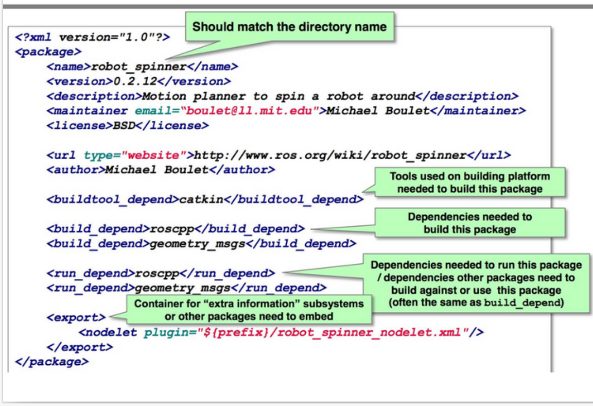
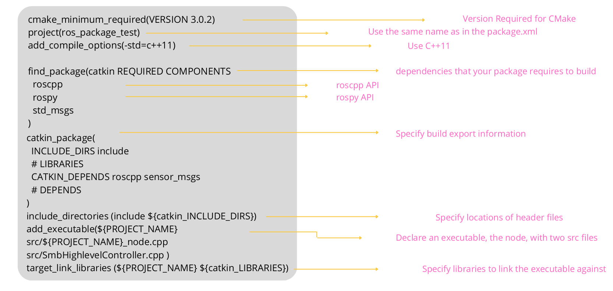
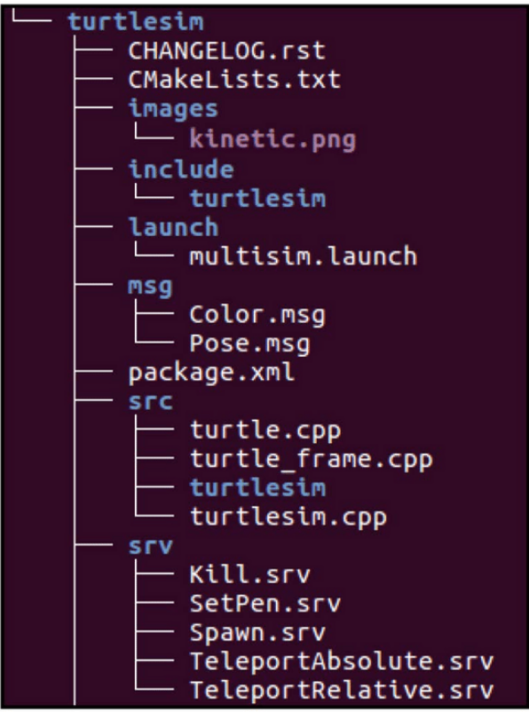

# ROS Introduction and Installation

Author: Mohamed Elshamy

Review : KG

# Introduction to ROS

* ROS is an open-source `robot operating system`.
* A set of software libraries and tools that help you build robot applications that work across a wide variety of robotic platforms
* Originally developed in 2007 at the Stanford Artificial Intelligence
* Laboratory and development continued at Willow Garage
* Since 2013 managed by `OSRF` (Open Source Robotics Foundation)

### ROS Distributions:


# ROS Architecture and Components

* ROS (Robot Operating System) is a `framework` widely used for developing robot software.
* It's not a traditional operating system, but rather a set of software frameworks for robot software development. It provides various tools and libraries that help in building, visualizing, and controlling robotic systems.
ROS (Robot Operating System) is a framework for developing robot software.
* It consists of three levels of concepts: the `Filesystem level`, the `Computation Graph level`, and the `Community level1`.

## Filesystem Level

At the Filesystem Level, ROS resources are organized on disk as follows:

* **Packages**: These are the fundamental units for organizing software within ROS. Each package contains essential elements such as ROS nodes, libraries, configuration files, and other resources crucial for robot applications. A package adheres to a predefined structure and includes metadata provided by a `package.xml` file.

* **Metapackages**: These special packages serve as containers for grouping related packages. They play a key role in defining dependencies and facilitating software distribution. For instance, the `ros_base` metapackage encompasses core ROS packages.

* **Message Types**: These define the structure of data exchanged between ROS nodes. Stored in `.msg` files within a package's `msg` directory, message types play a critical role in communication between nodes.

* **Service Types**: These define the structure of requests and responses for services offered by ROS nodes. Stored in `.srv` files within a package's `srv` directory, service types enable the provision of specific functionalities within a ROS system.

* **Action Types**: These define the structure of goals, feedback, and results for actions executed by ROS nodes. Stored in `.action` files within a package's `action` directory, action types facilitate the execution of complex tasks within a ROS environment.

## Computation Graph Level

The Computation Graph level describes the communication between ROS processes that are running on one or more machines. The main concepts are:


* **Master**: The Master is a central process that provides name and registration services for the nodes in the ROS system. It allows nodes to find and communicate with each other. The Master also provides a Parameter Server, which is a shared dictionary of key-value pairs that nodes can access and modify.

* **Nodes**: Nodes are `executable` programs that perform computation and communicate with each other using ROS topics, services, actions, or parameters. Nodes can be written in different languages, such as Python, C++, or Lisp.

* **Topics**: Topics are named buses that nodes can use to exchange messages. A node can publish messages to a topic or subscribe to messages from a topic. Topics are `anonymous` and `asynchronous`, meaning that the publisher and subscriber do not need to know each other or wait for each other.


* **Services**: Services are named pairs of request and response messages that nodes can use to invoke `synchronous` remote procedure calls. A node can offer a service or call a service. Services are persistent and `synchronous`, meaning that the service provider and the service client need to be available and `wait` for each other.

* **Actions**: Actions are named triples of `goal`, `feedback`, and `result` messages that nodes can use to perform long-running tasks. A node can provide an action or execute an action. Actions are persistent and `asynchronous`, meaning that the action provider and the action client can communicate and monitor the progress of the task without blocking each other.

## Community Level

The Community level encompasses the tools and conventions for sharing and distributing ROS software. The main concepts are:

* **Repositories**: Repositories are collections of packages that share a common version control system, such as Git or SVN. Repositories can be hosted on platforms such as GitHub or Bitbucket, and can be indexed by ROS tools for easy access.

* **Distributions**: Distributions are collections of packages that are tested and released together, such as ROS Kinetic or ROS Melodic. Distributions have a fixed release cycle and support policy, and can be installed from pre-built binaries or source code.

* **[ROS Index](https://index.ros.org/)**: ROS Index is a web portal that provides information and documentation for ROS packages, repositories, and distributions. It also allows users to search, browse, and rate ROS software.

* **[ROS Wiki](https://wiki.ros.org/Documentation)**: ROS Wiki is a collaborative website that hosts tutorials, guides, and specifications for ROS. It also serves as a platform for community feedback and discussion.

* **[Stack exchange](https://robotics.stackexchange.com/)**: Stack exchange is a question-and-answer site that helps users solve problems and learn more about ROS. It also fosters a culture of helping and learning within the ROS community.

## ROS Workspaces and ROS Packages

### ROS Workspaces

ROS Workspace is a concept that helps organize your Robot Operating System (ROS) projects. Think of it as a designated folder where you manage related pieces of ROS code.

The official name for workspaces in ROS is `catkin workspaces`.

#### Components of ROS Workspace

A **Catkin ROS workspace** contains three main spaces:

`src` : contains source code, this will be your main work folder.

`devel` : contains setup files for the project ROS environment.

`build` : contains the compiled binary files.


#### Creating a ROS Workspace

You can create a workspace by open a terminal and execute the following commands:

```bash
mkdir -p ~/catkin_ws/src
cd ~/catkin_ws/src
catkin_init_workspace
```

### ROS Packages

ROS packages reside in the `src` space. In ROS, software is organised in ROS packages.

A ROS package typically contains the following things:

* `CMakeList.txt` &rarr; includes directives for finding dependencies, configuring build options, and defining targets

* `package.xml` &rarr; provides metadata about the package, including its name, version, description, dependencies, maintainers, and licensing information.

* `scripts` &rarr; This folder contains all Python scripts

* `src` &rarr; This folder contains all C++ source files

* `msg` &rarr; for custom message definitions

* `srv` &rarr; for service message definitions

* `include` &rarr; headers/libraries that are needed as dependencies

* `config` &rarr; configuration files

* `launch` &rarr; provide a more automated way of starting nodes

* `URDF` &rarr; Universal Robot Description Files

* `meshes` &rarr; CAD files in .dae (Collada) or .stl (STereoLithography) format

* `worlds` &rarr; XML like files that are used for Gazebo simulation environments


#### package.xml

The package.xml file defines the properties of the
package:

* Package name &rarr; `first_package`
* Version number &rarr; `V.0.1`
* Authors &rarr; `Mohamed Elshamy`
* Dependencies on other packages &rarr; `std_msgs, roscpp`



#### CMakeLists.txt

The main `CMake` file to build the package
Calls catkin-specific functions/macros

* `Read` the package.xml
* find other catkin packages to access libraries / include directories
* export items for other packages depending on yours



---

#### ROS Package Example

There is a turtlesim package



---

#### Creating ROS package

You can create a ROS package by open a terminal and execute the following commands:

```bash
cd ~/catkin_ws/src
catkin_init_workspace
catkin_create_pkg arab_meetup_robot std_msgs rospy roscpp
```

### Building ROS workspaces and ROS packages

Once your workspace is set up, you can start building packages using the `catkin_make` command.

#### catkin_make

`catkin_make` builds all packages in the workspace.

```bash
cd ~/catkin_ws
catkin_make
```

# ROS installation and setup

To install ROS `neotic` run this [script file](https://github.com/arab-meet/2.ROS_Basics_Workshop/blob/pr_intro_into_ros/scripts/ros.sh) or install it manually by the following steps:

* Setup your computer to accept software
from packages.ros.org.

``` bash
sudo sh -c 'echo "deb http://packages.ros.org/ros/ubuntu $(lsb_release -sc) main" >
/etc/apt/sources.list.d/ros-latest.list'
```

``` bash
sudo apt install curl  
```

* Check the system is up-to-date

```bash
sudo apt update
```

```bash
sudo apt install ros-noetic-desktop-full
```

* Then added to your bash

```bash
echo "source /opt/ros/noetic/setup.bash" >> ~/.bashrc
```

```bash
source ~/.bashrc
```

```bash
source /opt/ros/noetic/setup.bash
```

* Install tool and dependencies

```bash
sudo apt install python3-rosdep python3-rosinstall python3-rosinstall-generator python3-wstool build-essential
```

* Run some core components in ROS

```bash 
sudo apt install python3-rosdep
```

```bash
sudo rosdep init
```

```bash
rosdep update
```

* To make sure that you have ROS run the following command

```bash
 printenv | grep ROS
```

* And the result should be like this:

```bash
ROS_ROOT=/opt/ros/noetic/share/ros
ROS_PACKAGE_PATH=/opt/ros/noetic/share
ROS_MASTER_URI=http://localhost:11311
ROS_VERSION=1
ROSLISP_PACKAGE_DIRECTORIES=
ROS_DISTRO=noetic
ROS_ETC_DIR=/opt/ros/noetic/etc/ros
```

# Basic ROS Commands and Tools

ROS (Robot Operating System) is a framework for developing robot software. It provides a set of tools and libraries that simplify creating complex and robust robot behavior across various robotic platforms. In this tutorial, we will learn some of the most common and useful ROS commands and tools that can help us interact with ROS nodes, topics, services, parameters, and more.

## ROS Nodes

Nodes are executable programs that perform computation and communicate with each other using ROS topics, services, actions, or parameters. Nodes can be written in different languages, such as Python, C++, or Lisp. To manage and inspect nodes, we can use the following commands:

`rosnode list` &rarr; This command lists the names of all the active nodes in the ROS system.

`rosnode info` &rarr; This command prints information about a specific node, such as its publications, subscriptions, services, and connections.

`rosnode ping` &rarr; This command tests the connectivity to a node by sending ping requests and measuring the response time.

`rosnode kill` &rarr; This command terminates a node by sending a shutdown request.

## ROS Topics

Topics are named buses that nodes can use to exchange messages. A node can publish messages to a topic or subscribe to messages from a topic. Topics are anonymous and asynchronous, meaning that the publisher and subscriber do not need to know each other or wait for each other. To manage and inspect topics, we can use the following commands:

`rostopic list` &rarr; This command lists the names of all the active topics in the ROS system.

`rostopic info` &rarr; This command prints information about a specific topic, such as its type, publishers, and subscribers.

`rostopic echo` &rarr; This command prints the messages being sent on a topic to the screen.

`rostopic pub` &rarr; This command publishes a message of a given type and arguments to a topic from the command line.

`rostopic hz` &rarr; This command measures the rate of messages being published on a topic.

## ROS Services

Services are named pairs of request and response messages that nodes can use to invoke synchronous remote procedure calls. A node can offer a service or call a service. Services are persistent and synchronous, meaning that the service provider and the service client need to be available and wait for each other. To manage and inspect services, we can use the following commands:

`rosservice list` &rarr; This command lists the names of all the active services in the ROS system.

`rosservice info` &rarr; This command prints information about a specific service, such as its type, provider, and callers.

`rosservice call` &rarr; This command calls a service with the given arguments and prints the response.

`rosservice type` &rarr; This command prints the type of the request and response messages of a service.

## ROS Parameters

Parameters are named values that nodes can use to store and retrieve configuration data. Parameters are stored on a central server called the Parameter Server, which is part of the ROS Master. Parameters can have different types, such as strings, integers, floats, booleans, arrays, or dictionaries. To manage and inspect parameters, we can use the following commands:

`rosparam list` &rarr; This command lists the names of all the parameters in the ROS system.

`rosparam get` &rarr; This command prints the value of a specific parameter or a namespace of parameters.

`rosparam set` &rarr; This command sets the value of a parameter or a namespace of parameters.

`rosparam dump` &rarr; This command dumps all the parameters to a YAML file.

`rosparam load` &rarr; This command loads all the parameters from a YAML file.

## ROS Tools

In addition to the command-line tools, ROS also provides graphical tools that can help us visualize, debug, and analyze ROS data. Some of the most popular ROS tools are:

`roscore` &rarr; The basis nodes and programs for ROS-based systems. A roscore must be running for ROS nodes to communicate.

`rosrun` &rarr; Runs a ROS package’s executable with minimal typing.

`rqt` &rarr; rqt is a Qt-based framework that integrates various ROS tools into a single interface. It allows us to create customized GUIs using plugins, such as rqt_graph, rqt_console, rqt_plot, rqt_image_view, and more.

`rviz` &rarr; rviz is a 3D visualization tool that can display sensor data, robot models, navigation maps, and more. It allows us to interact with the robot and the environment using interactive markers, tools, and panels.

`rosbag` &rarr; rosbag is a tool that can record and playback ROS message data. It allows us to store and analyze ROS data offline, such as sensor readings, robot poses, images, and more.

`roslaunch` &rarr; roslaunch is a tool that can start multiple nodes at once using launch files. It allows us to configure and manage complex ROS systems, such as setting parameters, remapping topics, and launching other launch files.

# [Next Topic Link]

# References:

### [&lt;-Back to main](../README.md)
