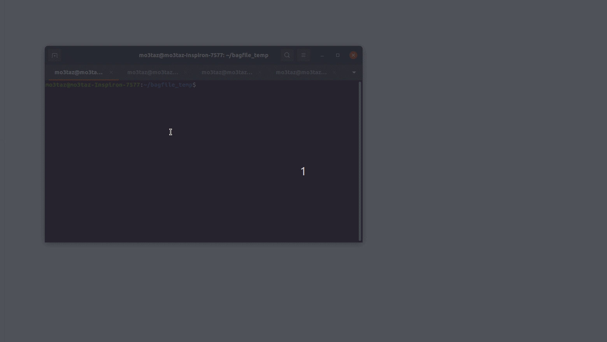
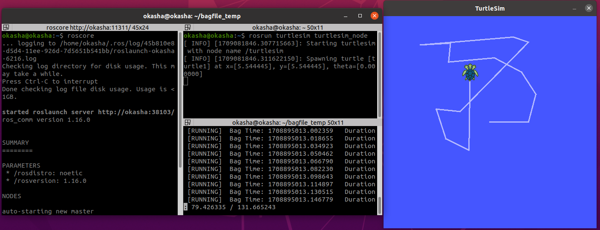

# ROS Bag
Author : Mahmoud Okasha

Reviewed By: Mo3taz

## What is a ROS bag file 
- bag file stores the data published into topics , you can then replay this data in order to reproduce the same result that you get. 

- Recording topics is also a great way to share your work and allow others to recreate it and if you have problem in your package you can share the bag file with other Engineers to test your package.


### Recording  data

- Frist you need to run your node or package to publish the data in topic

```bash
roscore
```


```bash
rosrun turtlesim turtlesim_node
```


- Second start record
``-a`` that mean start record all topics

```bash
rosbag record -a
```
Record a bag file with the contents of the ``specified topics``.

```bash
rosbag record rosout tf cmd_vel
```

Show the usage and exit.
```bash
rosbag record -h
```


- Start `turtlesim_node` and `turtle_teleop_key`
    - just to make turtlesim move and when we record you can see the same behavior 

```bash
rosrun turtlesim turtle_teleop_key
```


```bash
mkdir bagfile_temp
cd bagfile_temp
rosbag record -a
```

- If you want to end the record press ``ctrl + c``

### demo turtle sim with bag file record



- after you recored what you want now you can share your bag with other 


- Examining and playing the bag file

**To examine information on what was recorded in the bag, use the command:**
>note: you can change the name of `.bag` file in the example its name is `2024-02-25-23-02-13.bag`
```bash
cd bagfile_temp/
rosbag info 2024-02-25-23-02-13.bag
```


**To replay the bag file to reproduce the behavior in the running system:**
- Start `turtlesim_node`

```bash
roscore
```


```bash
rosrun turtlesim turtlesim_node
```


- Replay the bag file
```bash
cd bagfile_temp/
rosbag play 2024-02-25-23-02-13.bag
```


>**note:** If you want to replay the bag file with different rate use this command below.

```bash
rosbag play -r 2 2024-02-25-23-02-13.bag
```

### demo turtlesim with bag file record and play


---


# References:
[ros bag](http://wiki.ros.org/rosbag)

### [&lt;-Back to main](../README.md)